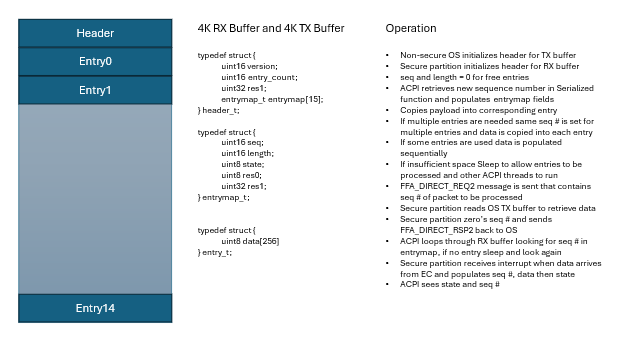
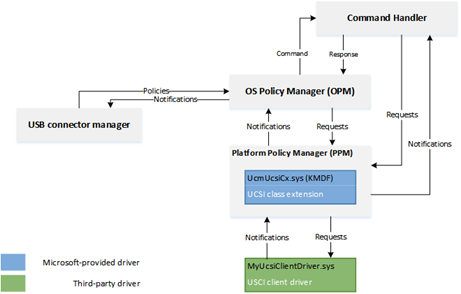

# Copyright

This document is provided "as-is." Information and views expressed in
this document, including URL and other Internet Web site references, may
change without notice.

Some examples depicted herein are provided for illustration only and are
fictitious. No real association or connection is intended or should be
inferred.

This document does not provide you with any legal rights to any
intellectual property in any Microsoft product. This document is
confidential and proprietary to Microsoft. It is disclosed and can be
used only pursuant to a non-disclosure agreement.

© 2022 Microsoft. All rights reserved.

CONFIDENTIAL.  Distribution Only to Partners Under
Nondisclosure. Microsoft makes no warranties, express or implied. 

Please refer to [<span class="underline">Microsoft
Trademarks</span>](http://www.microsoft.com/en-us/legal/intellectualproperty/Trademarks/EN-US.aspx)
for a list of trademarked products.

Portions of this software may be based on NCSA Mosaic. NCSA Mosaic was
developed by the National Center for Supercomputing Applications at the
University of Illinois at Urbana-Champaign. Distributed under a
licensing agreement with Spyglass, Inc.

All other trademarks are property of their respective owners.

The policies and requirements expressed within are applicable for the
versions of Windows noted, except as otherwise required by or subject to
local law, rule, regulation, order, or decree from an applicable
governing regulatory authority.

# Contents

[1 Copyright 2](#_Toc185577786)

[2 EC SOC Interface 9](#ec-soc-interface)

[3 Legacy EC Interface 9](#legacy-ec-interface)

[4 Secure EC Services Overview 13](#secure-ec-services-overview)

[5 EC Firmware Management 31](#ec-firmware-management)

[6 EC Power Service 34](#ec-power-service)

[7 Battery Service 34](#battery-service)

[8 Thermal Zone Service 46](#thermal-zone-service)

[9 Fan Service 53](#fan-service)

[10 UCSI Interface 55](#ucsi-interface)

[11 EC Input Management 58](#ec-input-management)

[12 EC Time Alarm Service 59](#ec-time-alarm-service)

[13 EC Debug Service 65](#ec-debug-service)

[14 EC Manufacturing Service 67](#ec-manufacturing-service)

[15 EC OEM Service 67](#ec-oem-service)

[16 Sample System Implementation 67](#sample-system-implementation)

# EC SOC Interface

## EC Physical Interface

The interface by which the EC is physically wired to the SOC may vary
depending on what interfaces are supported by the Silicon Vendor, EC
manufacturer and OEM. It is recommended that a simple and low latency
protocol is chosen such as eSPI, I3C, I2C or SPI.

## EC Software Interface

There are several existing OS interfaces that exist today via ACPI and
HID to manage thermal, battery, keyboard, touch etc. These existing
structures need to keep working and any new interface must be created in
such a way that it does not break existing interfaces. This document
covers details on how to implement EC services in secure world and keep
compatibility with non-secure EC OperationRegions. It is important to
work towards a more robust solution that will handle routing, larger
packets and security in a common way across OS’s and across SV
architectures. Investigation of SCMI, TCP/IP and various protocols are
being considered with various partners. This specification outlines
implementation with existing ACPI interfaces and limitations.

# Legacy EC Interface

ACPI specification has a definition for an embedded controller, however
this implementation is tied very closely to the eSPI bus and x86
architecture.

The following is an example of legacy EC interface definition from ACPI

[11.7. Thermal Zone Examples — ACPI Specification 6.4
documentation](https://uefi.org/htmlspecs/ACPI_Spec_6_4_html/11_Thermal_Management/thermal-zone-examples.html)

```
Scope(\\_SB.PCI0.ISA0) {
  Device(EC0) {
    Name(_HID, EISAID("PNP0C09")) // ID for this EC

    // current resource description for this EC
    Name(_CRS, ResourceTemplate() {
      IO(Decode16,0x62,0x62,0,1)
      IO(Decode16,0x66,0x66,0,1)
    })

    Name(_GPE, 0) // GPE index for this EC
    
    // create EC's region and field for thermal support
    OperationRegion(EC0, EmbeddedControl, 0, 0xFF)
    Field(EC0, ByteAcc, Lock, Preserve) {
      MODE, 1, // thermal policy (quiet/perform)
      FAN, 1, // fan power (on/off)
      , 6, // reserved
      TMP, 16, // current temp
      AC0, 16, // active cooling temp (fan high)
      , 16, // reserved
      PSV, 16, // passive cooling temp
      HOT 16, // critical S4 temp
      CRT, 16 // critical temp
    }

    // following is a method that OSPM will schedule after
    // it receives an SCI and queries the EC to receive value 7
    Method(_Q07) {
      Notify (\\_SB.PCI0.ISA0.EC0.TZ0, 0x80)
    } // end of Notify method

    // fan cooling on/off - engaged at AC0 temp
    PowerResource(PFAN, 0, 0) {
      Method(_STA) { Return (\\_SB.PCI0.ISA0.EC0.FAN) } // check power state
      Method(_ON) { Store (One, \\\\_SB.PCI0.ISA0.EC0.FAN) } // turn on fan
      Method(_OFF) { Store ( Zero, \\\\_SB.PCI0.ISA0.EC0.FAN) }// turn off
fan
    }

    // Create FAN device object
    Device (FAN) {
    // Device ID for the FAN
    Name(_HID, EISAID("PNP0C0B"))
    // list power resource for the fan
    Name(_PR0, Package(){PFAN})
    }

    // create a thermal zone
    ThermalZone (TZ0) {
      Method(_TMP) { Return (\\_SB.PCI0.ISA0.EC0.TMP )} // get current temp
      Method(_AC0) { Return (\\_SB.PCI0.ISA0.EC0.AC0) } // fan high temp
      Name(_AL0, Package(){\\_SB.PCI0.ISA0.EC0.FAN}) // fan is act cool dev
      Method(_PSV) { Return (\\_SB.PCI0.ISA0.EC0.PSV) } // passive cooling
temp
      Name(_PSL, Package (){\\_SB.CPU0}) // passive cooling devices
      Method(_HOT) { Return (\\_SB.PCI0.ISA0.EC0.HOT) } // get critical S4
temp
      Method(_CRT) { Return (\\_SB.PCI0.ISA0.EC0.CRT) } // get critical temp
      Method(_SCP, 1) { Store (Arg1, \\\\_SB.PCI0.ISA0.EC0.MODE) } // set
cooling mode

      Name(_TSP, 150) // passive sampling = 15 sec
      Name(_TZP, 0) // polling not required
      Name (_STR, Unicode ("System thermal zone"))
    } // end of TZ0
  } // end of ECO
} // end of \\\\_SB.PCI0.ISA0 scope-
```

On platforms that do not support IO port access there is an option to
define MMIO regions to simulate the IO port transactions.

In the above example you can see that the operation region directly maps
to features on the EC and you can change the EC behavior by writing to a
byte in the region or reading the latest data from the EC.

For a system with the EC connected via eSPI and that needs a simple
non-secure interface to the EC the above mapping works very well and
keeps the code simple. The eSPI protocol itself has details on port
accesses and uses the peripheral channel to easily read/write memory
mapped regions.

As the EC features evolve there are several requirements that do no work
well with this interface:

  - Different buses such as I3C, SPI, UART target a packet
    request/response rather than a memory mapped interface

  - Protected or restricted access and validation of request/response

  - Firmware update, large data driven requests that require larger data
    response the 256-byte region is limited

  - Discoverability of features available and OEM customizations

  - Out of order completion of requests, concurrency, routing and
    priority handling

As we try to address these limitations and move to a more packet based
protocol described in this document. The following section covers
details on how to adopt existing operation region to new ACPI
functionality.

## Adopting EC Operation Region

The new OS frameworks such as MPTF still use ACPI methods as primary
interface. Instead of defining devices such as FAN or ThermalZone in the
EC region you can simply define the EC region itself and then map all
the other ACPI functions to operate on this region. This will allow you
to maintain backwards compatibility with existing EC definitions.

```
Device(EC0) {
  Name(_HID, EISAID("PNP0C09")) // ID for this EC
  // current resource description for this EC
  Name(_CRS, ResourceTemplate() {
    IO(Decode16,0x62,0x62,0,1)
    IO(Decode16,0x66,0x66,0,1)
  })

  // create EC's region and field for thermal support
  OperationRegion(EC0, EmbeddedControl, 0, 0xFF)
  Field(EC0, ByteAcc, Lock, Preserve) {
    MODE, 1, // thermal policy (quiet/perform)
    FAN, 1, // fan power (on/off)
    , 6, // reserved
    TMP, 16, // current temp
    AC0, 16, // active cooling temp (fan high)
    , 16, // reserved
    PSV, 16, // passive cooling temp
    HOT 16, // critical S4 temp
    CRT, 16 // critical temp
  }
}

Device(SKIN) {
  Name(_HID, "MSFT000A") // New MPTF HID Temperature Device
  Method(_TMP, 0x0, Serialized) {
      Return( \\_SB.PCI0.ISA0.EC0.TMP)
  }
}
```

For more complicated functions that take a package some of the data may
be constructed within ACPI and some of the data pulled from the
OperationRegion. For example BIX for battery information may have a
combination of static and dynamic data like this:

```
Method (_BIX) {
  Name (BAT0, Package (0x12)
  {
    0x01, // Revision
    0x02, // Power Unit
    0x03, // Design Capacity
    \\_SB.PCI0.ISA0.EC0.BFCC, // Last Full Charge Capacity
    0x05, // Battery Technology
    0x06, // Design Voltage
    0x07, // Design capacity of Warning
    0x08, // Design Capacity of Low
    \\_SB.PCI0.ISA0.EC0.BCYL, // Cycle Count
    0x0A, // Measurement Accuracy
    0x0B, // Max Sampling Time
    0x0C, // Min Sampling Time
    0x0D, // Max Averaging Interval
    0x0E, // Min Averaging Interval
    0x0F, // Battery Capacity Granularity 1
    0x10, // Battery Capacity Granularity 2
    "Model123", // Model Number
    "Serial456", // Serial Number
    "Li-Ion", // Battery Type
    "OEMName" // OEM Information
  })
  Return(BAT0)
}
```

## Limitations for using Legacy EC

Before using the Legacy EC definition OEM’s should be aware of several
use cases that may limit you ability to use it.

### ACPI support for eSPI master

In the case of Legacy EC the communication to the EC is accomplished
directly by the ACPI driver using PORT IO and eSPI Peripheral Bus
commands. On ARM platforms there is no PORT IO and these must be
substituted with MMIO regions. The ACPI driver needs changes to support
MMIO which is being evaluated and support is not yet available. Some
Silicon Vendors also do not implement the full eSPI specification and as
such the ACPI driver cannot handle all the communication needs. On these
platforms using Legacy EC interface is not an option.

### Security of eSPI bus

When non-secure world is given access to the eSPI bus it can send
commands to device on that bus. Some HW designs have the TPM or SPINOR
on the same physical bus as the EC. On these designs allowing non-secure
world to directly sends commands to EC can break the security
requirements of other devices on the bus. In these cases the eSPI
communication must be done in the secure world over FF-A as covered in
this document and not use the Legacy EC channel. Since non-secure world
has complete access to the EC operation region there is no chance for
encryption of data. All data in the operation region is considered
non-secure.

### Functional limitations of Legacy EC

The peripheral region that is mapped in the Legacy EC in ACPI is limited
to 256 bytes and notification events to the ones that are defined and
handled in ACPI driver. To create custom solutions, send large packets
or support encryption of data the Legacy EC interface has limitations in
this area.

# Secure EC Services Overview

In this section we review a system design where the EC communication is
in the secure world running in a dedicated SP. In a system without
secure world or where communication to EC is not desired to be secure
all the ACPI functions can be mapped directly to data from the EC
operation region.

The following GUID’s have been designed to represent each service
operating in the secure partition for EC.

<table>
<thead>
<tr class="header">
<th>EC Service Name</th>
<th>Description</th>
</tr>
</thead>
<tbody>
<tr class="odd">
<td>EC_SVC_MANAGEMENT<br />
330c1273-fde5-4757-9819-5b6539037502</td>
<td>Used to query EC functionality, Board info, version, security state, FW update</td>
</tr>
<tr class="even">
<td>EC_SVC_POWER<br />
7157addf-2fbe-4c63-ae95-efac16e3b01c</td>
<td>Handles general power related requests and OS Sx state transition state notification</td>
</tr>
<tr class="odd">
<td><p>EC_SVC_BATTERY</p>
<p>25cb5207-ac36-427d-aaef-3aa78877d27e</p></td>
<td>Handles battery info, status, charging</td>
</tr>
<tr class="even">
<td><p>EC_SVC_THERMAL</p>
<p>31f56da7-593c-4d72-a4b3-8fc7171ac073</p></td>
<td>Handles thermal requests for skin and other thermal events</td>
</tr>
<tr class="odd">
<td><p>EC_SVC_FAN</p>
<p>7697530c-d079-4ec1-a4c4-cf0d2bdc93fa</p></td>
<td>Handles Fan control requests</td>
</tr>
<tr class="even">
<td>EC_SVC_UCSI<br />
65467f50-827f-4e4f-8770-dbf4c3f77f45</td>
<td>Handles PD notifications and calls to UCSI interface</td>
</tr>
<tr class="odd">
<td><p>EC_SVC_INPUT</p>
<p>e3168a99-4a57-4a2b-8c5e-11bcfec73406</p></td>
<td>Handles wake events, power key, lid, input devices (HID separate instance)</td>
</tr>
<tr class="even">
<td><p>EC_SVC_TIME_ALARM</p>
<p>23ea63ed-b593-46ea-b027-8924df88e92f</p></td>
<td>Handles RTC and wake timers.</td>
</tr>
<tr class="odd">
<td>EC_SVC_DEBUG<br />
0bd66c7c-a288-48a6-afc8-e2200c03eb62</td>
<td>Used for telemetry, debug control, recovery modes, logs, etc</td>
</tr>
<tr class="even">
<td>EC_SVC_TEST =<br />
6c44c879-d0bc-41d3-bef6-60432182dfe6</td>
<td>Used to send commands for manufacturing/factory test</td>
</tr>
<tr class="odd">
<td><p>EC_SVC_OEM1 =</p>
<p>9a8a1e88-a880-447c-830d-6d764e9172bb</p></td>
<td>Sample OEM custom service and example piping of events</td>
</tr>
</tbody>
</table>

## FFA Overview

This section covers the components involved in sending a command to EC
through the FFA flow in windows. This path is specific to ARM devices
and a common solution with x64 is still being worked out. Those will
continue through the non-secure OperationRegion in the near term.


ARM has a standard for calling into the secure world through SMC’s and
targeting a particular service running in secure world via a UUID. The
full specification and details can be found here: [Firmware Framework
for A-Profile](https://developer.arm.com/Architectures/Firmware%20Framework%20for%20A-Profile)

The windows kernel provides native ability for ACPI to directly send and
receive FFA commands. It also provides a driver ffadrv.sys to expose a
DDI that allows other drivers to directly send/receive FFA commands
without needing to go through ACPI.

Hyper-V forwards the SMC’s through to EL3 to Hafnium which then uses the
UUID to route the request to the correct SP and service. From the
corresponding EC service it then calls into the eSPI or underlying
transport layer to send and receive the request to the physical EC.

### FFA Device Definition

The FFA device is loaded from ACPI during boot and as such requires a
Device entry in ACPI

```
Device(\\_SB_.FFA0) {
  Name(_HID, "MSFT000C")
  OperationRegion(AFFH, FFixedHw, 4, 144)
  Field(AFFH, BufferAcc, NoLock, Preserve) { AccessAs(BufferAcc, 0x1), FFAC, 1152 }

  // Register notification events from FFA
  Method(_RNY, 0, Serialized) {
    Return( Package() {
      Package(0x2) {
        ToUUID("330c1273-fde5-4757-9819-5b6539037502"),
        Buffer() {0x1,0x0,0x2,0x0,0x3,0x0} // Register events 0x1, 0x2, 0x3
      }
    } )
  }

  Method(_NFY, 2, Serialized) {
    // Arg0 == UUID
    // Arg1 == Notify ID
    If(LEqual(ToUUID("330c1273-fde5-4757-9819-5b6539037502"),Arg0)) {
      Store(Arg1, \\_SB.ECT0.NEVT)
      Notify(\\_SB.ECT0, 0x20)
    }
  }

  // Other components check this to make sure FFA is available
  Method(AVAL, 0, Serialized) {
    Return(One)
  }
}
```

#### HID definition

The _HID “MSFT000C” is reserved for FFA devices. Defining this HID for
your device will cause the FFA interface for the OS to be loaded on this
device.

#### Operation Region Definition

The operation region is marked as FFixedHw type 4 which lets the ACPI
interpreter know that any read/write to this region requires special
handling. The length is 144 bytes because this region operates on
registers X0-X17 each of which are 8 bytes 18\*8 = 144 bytes. This is
mapped to FFAC is 1152 bits (144\*8) and this field is where we act
upon.

```
OperationRegion(AFFH, FFixedHw, 4, 144)
Field(AFFH, BufferAcc, NoLock, Preserve) { AccessAs(BufferAcc, 0x1),FFAC, 1152 }
```

When reading and writing from this operation region the FFA driver does
some underlying mapping for X0-X3

```
X0 = 0xc400008d // FFA_DIRECT_REQ2
X1 = (Receiver Endpoint ID) | (Sender Endpoint ID \<\< 16)
X2/X3 = UUID
```

The following is the format of the request and response packets that are
sent via ACPI

```
FFA_REQ_PACKET
{
  uint8 status; // Not used just populated so commands are symmetric
  uint8 length; // Number of bytes in rawdata
  uint128 UUID;
  uint8 reqdata[];
}

FFA_RSP_PACKET
{
  uint8 status; // Status from ACPI if FFA command was sent successfully
  uint8 length;
  uint128 UUID;
  uint64 ffa_status; // Status returned from the service of the FFA command
  uint8 rspdata[];
}

CreateByteField(BUFF,0,STAT) // Out – Status for req/rsp
CreateByteField(BUFF,1,LENG) // In/Out – Bytes in req, updates bytes returned
CreateField(BUFF,16,128,UUID) // In/Out - UUID of service
CreateDwordField(BUFF,18,FFST)// Out - FFA command status
```

#### Register Notification

During FFA driver initialization it calls into secure world to get a
list of all available services for each secure partition. After this we
send a SIMPLE_NOTIFICATION_SETUP request to each SP that has a service
which registers for notification events

```
Method(_RNY, 0, Serialized) {
  Return( Package() {
    Package(0x2) {
      ToUUID("330c1273-fde5-4757-9819-5b6539037502"),
      Buffer() {0x1,0x0,0x2,0x0,0x3,0x0} // Register events 0x1, 0x2, 0x3
    }
  } )
}
```


In the above example we indicate that the OS will handle 3 different
notification events for UUID 330c1273-fde5-4757-9819-5b6539037502 which
is our EC management UUID. FFA knows which secure partition this maps to
based on the list of services for each SP it has retrieved. Rather than
having to keep track of all the physical bits in the bitmask that are
used the FFA driver keeps track of this and allows each service to
create a list of virtual ID’s they need to handle. The FFA driver then
maps this to one of the available bits in the hardware bitmask and
passes this mapping down to the notification service running in a given
SP.

<h3>Input</h3>
<table>
<thead>
<tr class="header">
<th><strong>Parameter </strong></th>
<th><strong>Register </strong></th>
<th><strong>Value </strong></th>
</tr>
</thead>
<tbody>
<tr class="odd">
<td>Function<strong> </strong></td>
<td>X4 </td>
<td>0x1 </td>
</tr>
<tr class="even">
<td>UUID Lo<strong> </strong></td>
<td>X5 </td>
<td>Bytes [0..7] for the service UUID. </td>
</tr>
<tr class="odd">
<td>UUID Hi<strong> </strong></td>
<td>X6 </td>
<td>Bytes [8..16] for the service UUID. </td>
</tr>
<tr class="even">
<td>Mappings Count<strong> </strong></td>
<td>X7 </td>
<td>The number of notification mappings </td>
</tr>
<tr class="odd">
<td>Notification Mapping1<strong> </strong></td>
<td>X8 </td>
<td><p>Bits [0..16] – Notification ID. --&gt; 0,1,2,3,... </p>
<p> </p>
<p>Bits [16..32] – Notification Bitmap bit number (0-383).  </p></td>
</tr>
<tr class="even">
<td>Notification Mapping2<strong> </strong></td>
<td>X9 </td>
<td><p>Bits [0..16] – Notification ID. --&gt; 0,1,2,3,... </p>
<p> </p>
<p>Bits [16..32] – Notification Bitmap bit number (0-383). </p>
<p> </p></td>
</tr>
<tr class="odd">
<td>...<strong> </strong></td>
<td>... </td>
<td>... </td>
</tr>
</tbody>
</table>

 

<h3>Output</h3>

| Parameter  | Register  | Value                        |
| ---------- | --------- | -------------------------------- |
| Result     | X4        | 0 on success. Otherwise, Failure |

 

Note this SIMPLE_NOTIFICATION_SETUP request is sent to the
Notification Service UUID in the SP. The UUID of the service that the
notifications are for are stored in X5/X6 registers shown above.

The UUID for notification service is
{B510B3A3-59F6-4054-BA7A-FF2EB1EAC765} which is stored in X2/X3.

#### Notification Events

All notification events sent from all secure partitions are passed back
through the FFA driver. The notification received in ACPI has 2 input
parameters. The UUID of the service that sent the notification and the
Virtual ID of the notification.

```
Method(_NFY, 2, Serialized) {
  // Arg0 == UUID
  // Arg1 == Notify ID
  If(LEqual(ToUUID("330c1273-fde5-4757-9819-5b6539037502"),Arg0)) {
    Store(Arg1, \\_SB.ECT0.NEVT)
    Notify(\\_SB.ECT0, 0x20)
  }
}
```

The following is the call flow showing a secure interrupt arriving to
the EC service which results in a notification back to ACPI. The
notification payload can optionally be written to a shared buffer or
ACPI can make another call back into EC service to retrieve the
notification details.

The _NFY only contains the ID of the notification and no other payload,
so both ACPI and the EC service must be designed either with shared
memory buffer or a further notify data packet.


## Runtime Requests

During runtime the non-secure side uses FFA_MSG_SEND_DIRECT_REQ2
requests to send requests to a given service within an SP. Any request
that is expected to take longer than 500 uSec should yield control back
to the OS by calling FFA_YIELD within the service. When FFA_YIELD is
called it will return control back to the OS to continue executing but
the corresponding ACPI thread will be blocked until the original FFA
request completes with DIRECT_RSP2. Note this creates a polling type
interface where the OS will resume the SP thread after the timeout
specified. The following is sample call sequence.


### FFA Example Data Flow

For an example let’s take the battery status request _BST and follow
data through.


```
FFA_REQ_PACKET req = {
  0x0, // Initialize to no error
  0x1, // Only 1 byte of data is sent after the header
  {0x25,0xcb,0x52,0x07,0xac,0x36,0x42,0x7d,0xaa,0xef,0x3a,0xa7,0x88,0x77,0xd2,0x7e},
  0x2 // EC_BAT_GET_BST
}
```

The equivalent to write this data into a BUFF in ACPI is as follows

```
Name(BUFF, Buffer(32){}) // Create buffer for send/recv data
CreateByteField(BUFF,0,STAT) // Out – Status for req/rsp
CreateByteField(BUFF,1,LENG) // In/Out – Bytes in req, updates bytes returned
CreateField(BUFF,16,128,UUID) // UUID of service
CreateByteField(BUFF,18, CMDD) // In – First byte of command
CreateField(BUFF,144,128,BSTD) // Out – Raw data response 4 DWords
Store(20,LENG)
Store(0x2, CMDD)
Store(ToUUID ("25cb5207-ac36-427d-aaef-3aa78877d27e"), UUID)
Store(Store(BUFF, \\_SB_.FFA0.FFAC), BUFF)
```

The ACPI interpreter when walking through this code creates a buffer and
populates the data into buffer. The last line indicates to send this
buffer over FFA interface.

ACPI calls into the FFA interface to send the data over to the secure
world EC Service

```
typedef struct _FFA_INTERFACE {
    ULONG Version;
    PFFA_MSG_SEND_DIRECT_REQ2 SendDirectReq2;
} FFA_INTERFACE, \*PFFA_INTERFACE;
````

### FFA Parsing

FFA is in charge of sending the SMC over to the secure world and routing
to the correct service based on UUID.


```
X0 = SEND_DIRECT_REQ2 SMC command ID
X1 = Source ID and Destination ID
X2 = UUID Low
X3 = UUID High
X4-X17 = rawdata
```

**Note:** The status and length are not passed through to the secure
world they are consumed only be ACPI.

HyperV and Monitor have a chance to filter or deny the request, but in
general just pass the SMC request through to Hafnium

Hafnium extracts the data from the registers into an sp_msg structure
which is directly mapping contents from x0-x17 into these fields.

```
pub struct FfaParams {
    pub x0: u64,
    pub x1: u64,
    pub x2: u64,
    pub x3: u64,
    pub x4: u64,
    pub x5: u64,
    pub x6: u64,
    pub x7: u64,
    pub x8: u64,
    pub x9: u64,
    pub x10: u64,
    pub x11: u64,
    pub x12: u64,
    pub x13: u64,
    pub x14: u64,
    pub x15: u64,
    pub x16: u64,
    pub x17: u64,
}
```

In our SP we receive the raw FfaParams structure and we convert this to
an FfaMsg using our translator. This pulls out the function_id,
source_id, destination_id and uuid.

```
fn from(params: FfaParams) -> FfaMsg {
  FfaMsg {
    function_id: params.x0,              // Function id is in lower 32 bits of x0
    source_id: (params.x1 >> 16) as u16, // Source in upper 16 bits
    destination_id: params.x1 as u16,    // Destination in lower 16 bits
    uuid: u64_to_uuid(params.x2, params.x3),
    args64: [
      params.x4, params.x5, params.x6, params.x7, params.x8, params.x9, params.x10,
      params.x11, params.x12, params.x13, params.x14, params.x15, params.x16, params.x17,
            ],
  }
}
```

The destination_id is used to route the message to the correct SP, this
is based on the ID field in the DTS description file. Eg: id =
<0x8001>;

### EC Service Parsing

Within the EC partition there are several services that run, the routing
of the FF-A request to the correct services is done by the main message
handling loop for the secure partition. After receiving a message we
call into ffa_msg_handler and based on the UUID send it to the
corresponding service to handle the message.

```
let mut next_msg = ffa.msg_wait();
loop {
  match next_msg {
    Ok(ffamsg) => match ffa_msg_handler(&ffamsg) {
      Ok(msg) => next_msg = ffa.msg_resp(\&msg),
      Err(_e) => panic!("Failed to handle FFA msg"),
    },
    Err(_e) => {
      panic!("Error executing msg_wait");
    }
   }
}
```

The main message loop gets the response back from ffa_msg_handler and
returns to non-secure world so the next incoming message after the
response is a new message to handle.

```
fn ffa_msg_handler(msg: &FfaMsg) -> Result<FfaMsg> {
    println!(
        "Successfully received ffa msg:
        function_id = {:08x}
               uuid = {}",
        msg.function_id, msg.uuid
    );

    match msg.uuid {
        UUID_EC_SVC_MANAGEMENT => {
            let fwmgmt = fw_mgmt::FwMgmt::new();
            fwmgmt.exec(msg)
        }

        UUID_EC_SVC_NOTIFY => {
            let ntfy = notify::Notify::new();
            ntfy.exec(msg)
        }

        UUID_EC_SVC_POWER => {
            let pwr = power::Power::new();
            pwr.exec(msg)
        }

        UUID_EC_SVC_BATTERY => {
            let batt = battery::Battery::new();
            batt.exec(msg)
        }

        UUID_EC_SVC_THERMAL => {
            let thm = thermal::ThmMgmt::new();
            thm.exec(msg)
        }

        UUID_EC_SVC_UCSI => {
            let ucsi = ucsi::UCSI::new();
            ucsi.exec(msg)
        }

        UUID_EC_SVC_TIME_ALARM => {
            let alrm = alarm::Alarm::new();
            alrm.exec(msg)
        }

        UUID_EC_SVC_DEBUG => {
            let dbg = debug::Debug::new();
            dbg.exec(msg)
        }

        UUID_EC_SVC_OEM => {
            let oem = oem::OEM::new();
            oem.exec(msg)
        }

        _ => panic!("Unknown UUID"),
    }
}
```

### Large Data Transfers

When making an FFA_MSG_SEND_DIRECT_REQ2 call the data is stored in
registers X0-X17. X0-X3 are reserved to store the Function Id, Source
Id, Destination Id and UUID. This leaves X4-X17 or 112 bytes. For larger
messages they either need to be broken into multiple pieces or make use
of a shared buffer between the OS and Secure Partition.

#### Shared Buffer Definitions

To create a shared buffer you need to modify the dts file for the secure
partition to include mapping to your buffer.

```
ns_comm_buffer {
  description = "ns-comm";
  base-address = <0x00000100 0x60000000>;
  pages-count = <0x8>;
  attributes = <NON_SECURE_RW>;
};
```

During UEFI Platform initialization you will need to do the following
steps, see the FFA specification for more details on these commands

  - FFA_MAP_RXTX_BUFFER
  - FFA_MEM_SHARE
  - FFA_MSG_SEND_DIRECT_REQ2 (EC_CAP_MEM_SHARE)
  - FFA_UNMAP_RXTX_BUFFER

The RXTX buffer is used during larger packet transfers but can be
overridden and updated by the framework. The MEM_SHARE command uses the
RXTX buffer so we first map that buffer then populate our memory
descriptor requests to the TX_BUFFER and send to Hafnium. After sending
the MEM_SHARE request we need to instruct our SP to retrieve this
memory mapping request. This is done through our customer
EC_CAP_MEM_SHARE request where we describe the shared memory region
that UEFI has donated. From there we call FFA_MEM_RETRIEVE_REQ to map
the shared memory that was described to Hafnium. After we are done with
the RXTX buffers we must unmap them as the OS will re-map new RXTX
buffers. From this point on both Non-secure and Secure side will have
access to this shared memory buffer that was allocated.

### Async Transfers

All services are single threaded by default. Even when doing FFA_YIELD
it does not allow any new content to be executed within the service. If
you need your service to be truly asynchronous you must have commands
with delayed responses.

There is no packet identifier by default and tracking of requests and
completion by FFA, so the sample solution given here is based on shared
buffers defined in previous section and existing ACPI and FFA
functionality.


Inside of our FFA functions rather than copying our data payload into
the direct registers we define a queue in shared memory and populate the
actual data into this queue entry. In the FFA_MSG_SEND_DIRECT_REQ2
we populate an ASYNC command ID (0x0) along with the seq \#. The seq \#
is then used by the service to locate the request in the TX queue. We
define a separate queue for RX and TX so we don’t need to synchronize
between OS and secure partition.



### ACPI Structures and Methods for Asynchronous

The SMTX is shared memory TX region definition

```
// Shared memory regions and ASYNC implementation
OperationRegion (SMTX, SystemMemory, 0x10060000000, 0x1000)

// Store our actual request to shared memory TX buffer
Field (SMTX, AnyAcc, NoLock, Preserve)
{
  TVER, 16,
  TCNT, 16,
  TRS0, 32,
  TB0, 64,
  TB1, 64,
  TB2, 64,
  TB3, 64,
  TB4, 64,
  TB5, 64,
  TB6, 64,
  TB7, 64,
  Offset(0x100), // First Entry starts at 256 byte offset each entry is 256 bytes
  TE0, 2048,
  TE1, 2048,
  TE2, 2048,
  TE3, 2048,
  TE4, 2048,
  TE5, 2048,
  TE6, 2048,
  TE7, 2048,
}
```

The QTXB method copies data into first available entry in the TX queue
and returns sequence number used.

```
// Arg0 is buffer pointer
// Arg1 is length of Data
// Return Seq \#
Method(QTXB, 0x2, Serialized) {
  Name(TBX, 0x0)
  Store(Add(ShiftLeft(1,32),Add(ShiftLeft(Arg1,16),SEQN)),TBX)
  Increment(SEQN)
  // Loop until we find a free entry to populate
  While(One) {
    If(LEqual(And(TB0,0xFFFF),0x0)) {
      Store(TBX,TB0); Store(Arg0,TE0); Return( And(TBX,0xFFFF) )
    }

    If(LEqual(And(TB1,0xFFFF),0x0)) {
      Store(TBX,TB1); Store(Arg0,TE1); Return( And(TBX,0xFFFF) )
    }

    If(LEqual(And(TB2,0xFFFF),0x0)) {
      Store(TBX,TB2); Store(Arg0,TE2); Return( And(TBX,0xFFFF) )
    }

    If(LEqual(And(TB3,0xFFFF),0x0)) {
      Store(TBX,TB3); Store(Arg0,TE3); Return( And(TBX,0xFFFF) )
    }

    If(LEqual(And(TB4,0xFFFF),0x0)) {
      Store(TBX,TB4); Store(Arg0,TE4); Return( And(TBX,0xFFFF) )
    }

    If(LEqual(And(TB5,0xFFFF),0x0)) {
      Store(TBX,TB5); Store(Arg0,TE5); Return( And(TBX,0xFFFF) )
    }

    If(LEqual(And(TB6,0xFFFF),0x0)) {
      Store(TBX,TB6); Store(Arg0,TE6); Return( And(TBX,0xFFFF) )
    }

    If(LEqual(And(TB7,0xFFFF),0x0)) {
      Store(TBX,TB7); Store(Arg0,TE7); Return( And(TBX,0xFFFF) )
    }

    Sleep(5)
  }
}
```

The SMRX is shared memory region for RX queues

```
// Shared memory region
OperationRegion (SMRX, SystemMemory, 0x10060001000, 0x1000)

// Store our actual request to shared memory TX buffer
Field (SMRX, AnyAcc, NoLock, Preserve)
{
  RVER, 16,
  RCNT, 16,
  RRS0, 32,
  RB0, 64,
  RB1, 64,
  RB2, 64,
  RB3, 64,
  RB4, 64,
  RB5, 64,
  RB6, 64,
  RB7, 64,
  Offset(0x100), // First Entry starts at 256 byte offset each entry is 256 bytes
  RE0, 2048,
  RE1, 2048,
  RE2, 2048,
  RE3, 2048,
  RE4, 2048,
  RE5, 2048,
  RE6, 2048,
  RE7, 2048,
}
```

The RXDB function takes sequence number as input and will keep looping
through all the entries until we see packet has completed. Sleeps for
5ms between each iteration to allow the OS to do other things and other
ACPI threads can run.

```
// Allow multiple threads to wait for their SEQ packet at once
// If supporting packet \> 256 bytes need to modify to stitch together packet
Method(RXDB, 0x1, Serialized) {
  Name(BUFF, Buffer(256){})
  // Loop forever until we find our seq
  While (One) {
    If(LEqual(And(RB0,0xFFFF),Arg0)) {
      CreateField(BUFF, 0, Multiply(And(ShiftRight(RB0,16),0xFFFF),8), XB0)
      Store(RE0,BUFF); Store(0,RB0); Return( XB0 )
    }

    If(LEqual(And(RB1,0xFFFF),Arg0)) {
      CreateField(BUFF, 0, Multiply(And(ShiftRight(RB1,16),0xFFFF),8), XB1)
      Store(RE1,BUFF); Store(0,RB1); Return( XB1 )
    }

    If(LEqual(And(RB2,0xFFFF),Arg0)) {
      CreateField(BUFF, 0, Multiply(And(ShiftRight(RB2,16),0xFFFF),8), XB2)
      Store(RE2,BUFF); Store(0,RB2); Return( XB2 )
    }

    If(LEqual(And(RB3,0xFFFF),Arg0)) {
      CreateField(BUFF, 0, Multiply(And(ShiftRight(RB3,16),0xFFFF),8), XB3)
      Store(RE3,BUFF); Store(0,RB3); Return( XB3 )
    }

    If(LEqual(And(RB4,0xFFFF),Arg0)) {
      CreateField(BUFF, 0, Multiply(And(ShiftRight(RB4,16),0xFFFF),8), XB4)
      Store(RE4,BUFF); Store(0,RB4); Return( XB4 )
    }

    If(LEqual(And(RB5,0xFFFF),Arg0)) {
      CreateField(BUFF, 0, Multiply(And(ShiftRight(RB5,16),0xFFFF),8), XB5)
      Store(RE5,BUFF); Store(0,RB5); Return( XB5 )
    }

    If(LEqual(And(RB6,0xFFFF),Arg0)) {
      CreateField(BUFF, 0, Multiply(And(ShiftRight(RB6,16),0xFFFF),8), XB6)
      Store(RE6,BUFF); Store(0,RB6); Return( XB6 )
    }

    If(LEqual(And(RB7,0xFFFF),Arg0)) {
      CreateField(BUFF, 0, Multiply(And(ShiftRight(RB7,16),0xFFFF),8), XB7)
      Store(RE7,BUFF); Store(0,RB7); Return( XB7 )
    }

    Sleep(5)
  }

  // If we get here didn't find a matching sequence number
  Return (Ones)
}
```

The following is sample code to transmit a ASYNC request and wait for
the data in the RX buffer.

```
Method(ASYC, 0x0, Serialized) {
  If(LEqual(\\_SB.FFA0.AVAL,One)) {
  Name(BUFF, Buffer(30){})
  CreateByteField(BUFF,0,STAT) // Out – Status for req/rsp
  CreateByteField(BUFF,1,LENG) // In/Out – Bytes in req, updates bytes returned
  CreateField(BUFF,16,128,UUID) // UUID of service
  CreateByteField(BUFF,18,CMDD) // Command register
  CreateWordField(BUFF,19,BSQN) // Sequence Number

  // x0 -\> STAT
  Store(20, LENG)
  Store(0x0, CMDD) // EC_ASYNC command
  Local0 = QTXB(BUFF,20) // Copy data to our queue entry and get back SEQN
  Store(Local0,BSQN) // Sequence packet to read from shared memory
  Store(ToUUID("330c1273-fde5-4757-9819-5b6539037502"), UUID)
  Store(Store(BUFF, \\_SB_.FFA0.FFAC), BUFF)

  If(LEqual(STAT,0x0) ) // Check FF-A successful?
  {
    Return (RXDB(Local0)) // Loop through our RX queue till packet completes
  }
}
```

## Recovery and Errors

The eSPI or bus driver is expected to detect if the EC is not responding
and retry. The FFA driver will report back in the status byte if it
cannot successfully talk to the secure world. If there are other
failures generally they should be returned back up through ACPI with a
value of (Ones) to indicate failure condition. This may cause some
features to work incorrectly.

It is also expected that the EC has a watchdog if something on the EC is
hung it should reset and reload on its own. The EC is also responsible
for monitoring that the system is running within safe parameters. The
thermal requests and queries are meant to be advisory in nature and EC
should be able to run independently and safely without any intervention
from the OS.

# EC Firmware Management

This service is to provide details about the security state, supported
features, debug, firmware version and firmware update functionality.

NIST SP 800-193 compliance requires failsafe update of primary and
backup EC FW images. EC should run from primary partition while writing
backup partitions and then change flag to indicate backup becomes
primary and primary becomes backup.

| Capability Command            | Description                                                 |
| ----------------------------- | ----------------------------------------------------------- |
| EC_CAP_GET_FW_STATE = 0x1 | Return details of FW in EC, DICE, Secure Boot, Version, etc |
| EC_CAP_GET_SVC_LIST = 0x2 | Get list of services/features that this EC supports         |
| EC_CAP_GET_BID = 0x3       | Read Board ID that is used customized behavior              |
| EC_CAP_TEST_NFY = 0x4      | Create test notification event                              |

## Get Firmware State

Returns start of the overall EC if DICE and secure boot was enabled,
currently running firmware version, EC status like boot failures.

### Secure Boot and DICE

DICE is a specification from the Trusted Computing Group that allows the
MCU to verify the signature of the code that it is executing, thereby
establishing trust in the code. To do this, it has a primary bootloader
program that reads the firmware on flash and using a key that is only
accessible by the ROM bootloader, can verify the authenticity of the
firmware. 

[<span class="underline">Trusted Platform Architecture - Device Identity
Composition Engine
(trustedcomputinggroup.org)</span>](https://trustedcomputinggroup.org/wp-content/uploads/Hardware-Requirements-for-Device-Identifier-Composition-Engine-r78_For-Publication.pdf) 

### Input Parameters

None

### Output Parameters

<table>
<thead>
<tr class="header">
<th>Field</th>
<th>Bits</th>
<th>Description</th>
</tr>
</thead>
<tbody>
<tr class="odd">
<td>FWVersion</td>
<td>16</td>
<td>Version of FW running on EC</td>
</tr>
<tr class="even">
<td>SecureState</td>
<td>8</td>
<td><p>Bit mask representing the secure state of the device</p>
<p>0 – DICE is enabled</p>
<p>1 – Firmware is signed</p></td>
</tr>
<tr class="odd">
<td>BootStatus</td>
<td>8</td>
<td><p>Boot status and error codes</p>
<p>0 = SUCCESS</p></td>
</tr>
</tbody>
</table>

### FFA ACPI Example

```
Method (TFWS) {
  // Check to make sure FFA is available and not unloaded
  If(LEqual(\\_SB.FFA0.AVAL,One)) {
    Name(BUFF, Buffer(32){}) // Create buffer for send/recv data
    CreateByteField(BUFF,0,STAT) // Out – Status for req/rsp
    CreateByteField(BUFF,1,LENG) // In/Out – Bytes in req, updates bytes returned
    CreateField(BUFF,16,128,UUID) // UUID of service
    CreateByteField(BUFF,18, CMDD) // In – First byte of command
    CreateField(BUFF,144,32,FWSD) // Out – Raw data response (overlaps with CMDD)

    Store(ToUUID("330c1273-fde5-4757-9819-5b6539037502"), UUID) // Management
    Store(20, LENG)
    Store(0x1, CMDD) // EC_CAP_GET_FW_STATE
    Store(Store(BUFF, \_SB_.FFA0.FFAC), BUFF)

    If(LEqual(STAT,0x0) ) // Check FF-A successful?
    {
      Return (FWSD)
    } else {
      Return(Zero)
    }
  } else {
    Return(Zero)
  }
}
```

## Get Features Supported

Get a list of services/features supported by this EC. Several features
like HID devices are optional and may not be present. OEM services may
also be added to this list as additional features supported.

### Input Parameters

None

### Output Parameters

<table>
<thead>
<tr class="header">
<th>Field</th>
<th>Bits</th>
<th>Description</th>
</tr>
</thead>
<tbody>
<tr class="odd">
<td>DebugMask</td>
<td>16</td>
<td><p>0 – Supports reset reason</p>
<p>1 – Supports debug tracing</p></td>
</tr>
<tr class="even">
<td>BatteryMask</td>
<td>8</td>
<td><p>0 – Battery 0 present</p>
<p>1 – Battery 1 present</p>
<p>…</p></td>
</tr>
<tr class="odd">
<td>FanMask</td>
<td>8</td>
<td><p>0 – FAN 0 present</p>
<p>1 – FAN 1 present</p>
<p>…</p></td>
</tr>
<tr class="even">
<td>ThermalMask</td>
<td>8</td>
<td>0 – Skin TZ present</td>
</tr>
<tr class="odd">
<td>HIDMask</td>
<td>8</td>
<td><p>0 – HID0 present</p>
<p>1 – HID1 present</p>
<p>…</p></td>
</tr>
<tr class="even">
<td>KeyMask</td>
<td>16</td>
<td><p>0 – Power key present</p>
<p>1 – LID switch present</p>
<p>2 – VolUp Key Present</p>
<p>3 – VolDown Key Present</p>
<p>4 – Camera Key Present</p></td>
</tr>
<tr class="odd">
<td></td>
<td></td>
<td></td>
</tr>
</tbody>
</table>

### FFA ACPI Example
```
Method(TFET, 0x0, Serialized) {
  If(LEqual(\\_SB.FFA0.AVAL,One)) {
    Name(BUFF, Buffer(24){})
    CreateByteField(BUFF,0,STAT) // Out – Status for req/rsp
    CreateByteField(BUFF,1,LENG) // In/Out – Bytes in req, updates bytes returned
    CreateField(BUFF,16,128,UUID) // UUID of service
    CreateByteField(BUFF,18,CMDD) // Command register
    CreateField(BUFF,144,48,FETD) // Output Data

    Store(20, LENG)
    Store(0x2, CMDD) // EC_CAP_GET_SVC_LIST
    Store(ToUUID("330c1273-fde5-4757-9819-5b6539037502"), UUID)
    Store(Store(BUFF, \\_SB_.FFA0.FFAC), BUFF)

    If(LEqual(STAT,0x0) ) {
      Return (FETD)
    } else {
      Return(Zero)
    }
  } else {
    Return(Zero)
  }
}
```

## Get Board ID

EC is often used to read pins or details to determine the HW
configuration based on GPIO’s or ADC values. This ID allows SW to change
behavior depending on this HW version information.

### Input Parameters

None

### Output Parameters

| Field   | Bits | Description    |
| ------- | ---- | -------------- |
| BoardID | 64   | Vendor defined |

### FFA ACPI Example
```
Method(TBID, 0x0, Serialized) {
  If(LEqual(\\_SB.FFA0.AVAL,One)) {
    Name(BUFF, Buffer(32){})
    CreateByteField(BUFF,0,STAT) // Out – Status for req/rsp
    CreateByteField(BUFF,1,LENG) // In/Out – Bytes in req, updates bytes returned
    CreateField(BUFF,16,128,UUID) // UUID of service
    CreateByteField(BUFF,18,CMDD) // Command register
    CreateDwordField(BUFF,18,BIDD) // Output Data
    Store(20, LENG)
    Store(0x3, CMDD) // EC_CAP_GET_BID
    Store(ToUUID("330c1273-fde5-4757-9819-5b6539037502"), UUID)
    Store(Store(BUFF, \\_SB_.FFA0.FFAC), BUFF)

    If(LEqual(STAT,0x0) ) {
      Return (BIDD)
    } else {
      Return(Zero)
    }
  } else {
    Return(Zero)
  }
}
```

## Firmware Update

This should initiate update of a particular firmware in the backup
partition to provide NIST SP 800-193 failsafe compliance. EC firmware
update is planned to be handled through CFU. Further details are
available in CFU specification.

# EC Power Service

## System Power State

OS calls in to notify EC or a change in system power state.

Perform appropriate power sequencing for the SoC from low power states
(S3, S4, S5) to S0, and from S0 to low power states

# Battery Service

Battery control is monitored through the Modern Power Thermal Framework
(MPTF). See this specification for further details on implementing
firmware for these features. This section outlines the interface
required in ACPI for this framework to function.

| Command                 | Description                                                                                                                                     |
| ----------------------- | ----------------------------------------------------------------------------------------------------------------------------------------------- |
| EC_BAT_GET_BIX = 0x1 | Returns information about battery, model, serial number voltage. Note this is a superset of BIF. (MPTF)                                         |
| EC_BAT_GET_BST = 0x2 | Get Battery Status, must also have notify event on state change. (MPTF)                                                                         |
| EC_BAT_GET_PSR = 0x3 | Returns whether this power source device is currently online. (MPTF)                                                                            |
| EC_BAT_GET_PIF = 0x4 | Returns static information about a power source. (MPTF)                                                                                         |
| EC_BAT_GET_BPS = 0x5 | Power delivery capabilities of battery at present time. (MPTF)                                                                                  |
| EC_BAT_SET_BTP = 0x6 | Set battery trip point to generate SCI event (MPTF)                                                                                             |
| EC_BAT_SET_BPT = 0x7 | Set Battery Power Threshold (MPTF)                                                                                                              |
| EC_BAT_GET_BPC = 0x8 | Returns static variables that are associated with system power characteristics on the battery path and power threshold support settings. (MPTF) |
| EC_BAT_SET_BMC= 0x9  | Battery Maintenance Control                                                                                                                     |
| EC_BAT_GET_BMD = 0xA | Returns battery information regarding charging and calibration                                                                                  |
| EC_BAT_GET_BCT = 0xB | Returns battery charge time.                                                                                                                    |
| EC_BAT_GET_BTM = 0xC | Get estimated runtime of battery while discharging                                                                                              |
| EC_BAT_SET_BMS = 0xD | Sets battery capacity sampling time in ms                                                                                                       |
| EC_BAT_SET_BMA = 0xE | Battery Measurement Average Interval                                                                                                            |

## EC_BAT_GET_BIX

Returns information about battery, model, serial number voltage etc

### Input Parameters

None

### Output Parameters

Should return structure as defined by ACPI specification

[10. Power Source and Power Meter Devices — ACPI Specification 6.4
documentation](https://uefi.org/htmlspecs/ACPI_Spec_6_4_html/10_Power_Source_and_Power_Meter_Devices/Power_Source_and_Power_Meter_Devices.html#bix-battery-information-extended)

### FFA ACPI Example
```
Method (_BIX) {
  // Check to make sure FFA is available and not unloaded
  If(LEqual(\\_SB.FFA0.AVAL,One)) {
    Name(BUFF, Buffer(144){}) // Create buffer for send/recv data
    CreateByteField(BUFF,0,STAT) // Out – Status for req/rsp
    CreateByteField(BUFF,1,LENG) // In/Out – Bytes in req, updates bytes returned
    CreateField(BUFF,16,128,UUID) // UUID of service
    CreateByteField(BUFF,18, CMDD) // In – First byte of command
    CreateField(BUFF,144,1088,BIXD) // Out – Raw data response max length

    Store(20, LENG)
    Store(0x1, CMDD) // EC_BAT_GET_BIX
    Store(ToUUID("25cb5207-ac36-427d-aaef-3aa78877d27e"), UUID) // Battery
    Store(Store(BUFF, \\_SB_.FFA0.FFAC), BUFF)


    If(LEqual(STAT,0x0) ) // Check FF-A successful?
    {
      Return (BIXD)
    } else {
      Return(Zero)
    }
  } else {
    Return(Zero)
  }
}
```

## EC_BAT_GET_BST

This object returns the present battery status. Whenever the Battery
State value changes, the system will generate an SCI to notify the OS.

### Input Parameters

None

### Output Parameters

Should return structure as defined by ACPI specification

[10. Power Source and Power Meter Devices — ACPI Specification 6.4
documentation](https://uefi.org/htmlspecs/ACPI_Spec_6_4_html/10_Power_Source_and_Power_Meter_Devices/Power_Source_and_Power_Meter_Devices.html#bst-battery-status)

### FFA ACPI Example

```
Method (_BST) {
  // Check to make sure FFA is available and not unloaded
  If(LEqual(\\_SB.FFA0.AVAL,One)) {
    Name(BUFF, Buffer(34){}) // Create buffer for send/recv data
    CreateByteField(BUFF,0,STAT) // Out – Status for req/rsp
    CreateByteField(BUFF,1,LENG) // In/Out – Bytes in req, updates bytes returned
    CreateField(BUFF,16,128,UUID) // UUID of service
    CreateByteField(BUFF,18, CMDD) // In – First byte of command
    CreateField(BUFF,144,128,BSTD) // Out – Raw data response 4 DWords

    Store(20, LENG)
    Store(0x2, CMDD) // EC_BAT_GET_BST
    Store(ToUUID("25cb5207-ac36-427d-aaef-3aa78877d27e"), UUID) // Battery
    Store(Store(BUFF, \\_SB_.FFA0.FFAC), BUFF)

    If(LEqual(STAT,0x0) ) // Check FF-A successful?
    {
      Return (BSTD)
    } else {
      Return(Zero)
    }
  } else {
    Return(Zero)
  }
}
```

## EC_BAT_GET_PSR

Returns whether the power source device is currently in use. This can be
used to determine if system is running off this power supply or adapter.
On mobile systes this will report that the system is not running on the
AC adapter if any of the batteries in the system is being forced to
discharge. In systems that contains multiple power sources, this object
reports the power source’s online or offline status.

### Input Parameters

None

### Output Parameters

Should return structure as defined by ACPI specification

[10. Power Source and Power Meter Devices — ACPI Specification 6.4
documentation](https://uefi.org/htmlspecs/ACPI_Spec_6_4_html/10_Power_Source_and_Power_Meter_Devices/Power_Source_and_Power_Meter_Devices.html#battery-control-methods)

### FFA ACPI Example

```
Method (_PSR) {
  // Check to make sure FFA is available and not unloaded
  If(LEqual(\_SB.FFA0.AVAL,One)) {
    Name(BUFF, Buffer(22){}) // Create buffer for send/recv data
    CreateByteField(BUFF,0,STAT) // Out – Status for req/rsp
    CreateByteField(BUFF,1,LENG) // In/Out – Bytes in req, updates bytes returned
    CreateField(BUFF,16,128,UUID) // UUID of service
    CreateByteField(BUFF,18, CMDD) // In – First byte of command
    CreateField(BUFF,144,32,PSRD) // Out – Raw data response (overlaps with CMDD)
    
    Store(20, LENG)
    Store(0x3, CMDD) // EC_BAT_GET_PSR
    Store(ToUUID("25cb5207-ac36-427d-aaef-3aa78877d27e"), UUID) // Battery
    Store(Store(BUFF, \_SB_.FFA0.FFAC), BUFF)

    If(LEqual(STAT,0x0) ) // Check FF-A successful?
    {
      Return (PSRD)
    } else {
      Return(Zero)
    }
  } else {
    Return(Zero)
  }
}
```
## EC_BAT_GET_PIF

This object returns information about the Power Source, which remains
constant until the Power Source is changed. When the power source
changes, the platform issues a Notify(0x0) (Bus Check) to the Power
Source device to indicate that OSPM must re-evaluate the _PIF object.

### Input Parameters

None

### Output Parameters

Should return structure as defined by ACPI specification

[10. Power Source and Power Meter Devices — ACPI Specification 6.4
documentation](https://uefi.org/htmlspecs/ACPI_Spec_6_4_html/10_Power_Source_and_Power_Meter_Devices/Power_Source_and_Power_Meter_Devices.html#pif-power-source-information)

### FFA ACPI Example
```
Method (_PIF) {
  // Check to make sure FFA is available and not unloaded
  If(LEqual(\\_SB.FFA0.AVAL,One)) {
    Name(BUFF, Buffer(22){}) // Create buffer for send/recv data
    CreateByteField(BUFF,0,STAT) // Out – Status for req/rsp
    CreateByteField(BUFF,1,LENG) // In/Out – Bytes in req, updates bytes returned
    CreateField(BUFF,16,128,UUID) // UUID of service
    CreateByteField(BUFF,18, CMDD) // In – First byte of command
    CreateField(BUFF,144,1088,PIFD) // Out – Raw data response (overlaps with CMDD)
    Store(20, LENG)
    Store(0x4, CMDD) // EC_BAT_GET_PIF
    Store(ToUUID("25cb5207-ac36-427d-aaef-3aa78877d27e"), UUID) // Battery
    Store(Store(BUFF, \_SB_.FFA0.FFAC), BUFF)

    If(LEqual(STAT,0x0) ) // Check FF-A successful?
    {
      Return (PIFD)
    } else {
      Return(Zero)
    }
  } else {
    Return(Zero)
  }
}
```

## EC_BAT_GET_BPS

This optional object returns the power delivery capabilities of the
battery at the present time. If multiple batteries are present within
the system, the sum of peak power levels from each battery can be used
to determine the total available power.

### Input Parameters

None

### Output Parameters

Should return structure as defined by ACPI specification

### FFA ACPI Example

```
Method (_BPS) {
  // Check to make sure FFA is available and not unloaded
  If(LEqual(\\_SB.FFA0.AVAL,One)) {
    Name(BUFF, Buffer(22){}) // Create buffer for send/recv data
    CreateByteField(BUFF,0,STAT) // Out – Status for req/rsp
    CreateByteField(BUFF,1,LENG) // In/Out – Bytes in req, updates bytes returned
    CreateField(BUFF,16,128,UUID) // UUID of service
    CreateByteField(BUFF,18, CMDD) // In – First byte of command
    CreateField(BUFF,144,136,BPSD) // Out – BSP structure 5 integers

    Store(20, LENG)
    Store(0x5, CMDD) // EC_BAT_GET_BPS
    Store(ToUUID("25cb5207-ac36-427d-aaef-3aa78877d27e"), UUID) // Battery
    Store(Store(BUFF, \_SB_.FFA0.FFAC), BUFF)

    If(LEqual(STAT,0x0) ) // Check FF-A successful?
    {
      Return (BPSD)
    } else {
      Return(Zero)
    }
  } else {
    Return(Zero)
  }
}
```

## EC_BAT_SET_BTP

This object is used to set a trip point to generate an SCI whenever the
Battery Remaining Capacity reaches or crosses the value specified in the
_BTP object. Required on systems supporting Modern Standby

[Platform design for modern standby | Microsoft
Learn](https://learn.microsoft.com/en-us/windows-hardware/design/device-experiences/platform-design-for-modern-standby)

### Input Parameters

See ACPI documentation for details

[10. Power Source and Power Meter Devices — ACPI Specification 6.4
documentation](https://uefi.org/htmlspecs/ACPI_Spec_6_4_html/10_Power_Source_and_Power_Meter_Devices/Power_Source_and_Power_Meter_Devices.html#btp-battery-trip-point)

### Output Parameters

None

### FFA ACPI Example
```
Method (_BTP) {
  // Check to make sure FFA is available and not unloaded
  If(LEqual(\\_SB.FFA0.AVAL,One)) {
    Name(BUFF, Buffer(24){}) // Create buffer for send/recv data
    CreateByteField(BUFF,0,STAT) // Out – Status for req/rsp
    CreateByteField(BUFF,1,LENG) // In/Out – Bytes in req, updates bytes returned
    CreateField(BUFF,16,128,UUID) // UUID of service
    CreateByteField(BUFF,18, CMDD) // In – First byte of command
    CreateDWordField(BUFF,19, BTP1) // In – Battery Trip Point

    Store(20, LENG)
    Store(0x6, CMDD) // EC_BAT_SET_BTP
    Store(Arg0, BTP1)
    Store(ToUUID("25cb5207-ac36-427d-aaef-3aa78877d27e"), UUID) // Battery
    Store(Store(BUFF, \_SB_.FFA0.FFAC), BUFF)

    If(LEqual(STAT,0x0) ) // Check FF-A successful?
    {
      Return (One)
    } else {
      Return(Zero)
    }
  } else {
    Return(Zero)
  }
}
```

## EC_BAT_GET_BPC

This optional object returns static values that are used to configure
power threshold support in the platform firmware. OSPM can use the
information to determine the capabilities of power delivery and
threshold support for each battery in the system.

### Input Parameters

None

### Output Parameters

Should return structure as defined by ACPI specification

[10. Power Source and Power Meter Devices — ACPI Specification 6.4
documentation](https://uefi.org/htmlspecs/ACPI_Spec_6_4_html/10_Power_Source_and_Power_Meter_Devices/Power_Source_and_Power_Meter_Devices.html#bpc-battery-power-characteristics)

### FFA ACPI Example
```
Method (_BPC) {
  // Check to make sure FFA is available and not unloaded
  If(LEqual(\\_SB.FFA0.AVAL,One)) {
    Name(BUFF, Buffer(24){}) // Create buffer for send/recv data
    CreateByteField(BUFF,0,STAT) // Out – Status for req/rsp
    CreateByteField(BUFF,1,LENG) // In/Out – Bytes in req, updates bytes returned
    CreateField(BUFF,16,128,UUID) // UUID of service
    CreateByteField(BUFF,18, CMDD) // In – First byte of command
    CreateField(BUFF,19,128, BPCD) // Out – BPC output Data

    Store(20, LENG)
    Store(0x8, CMDD) // EC_BAT_GET_BPC
    Store(ToUUID("25cb5207-ac36-427d-aaef-3aa78877d27e"), UUID) // Battery
    Store(Store(BUFF, \_SB_.FFA0.FFAC), BUFF)

    If(LEqual(STAT,0x0) ) // Check FF-A successful?
    {
      Return (BPCD)
    } else {
      Return(Zero)
    }
  } else {
    Return(Zero)
  }
}
```
## EC_BAT_SET_BPT

his optional object may be present under a battery device. OSPM must
read _BPC first to determine the power delivery capability threshold
support in the platform firmware and invoke this Method in order to
program the threshold accordingly. If the platform does not support
battery peak power thresholds, this Method should not be included in the
namespace.

### Input Parameters

See ACPI specification for input parameters

[10. Power Source and Power Meter Devices — ACPI Specification 6.4
documentation](https://uefi.org/htmlspecs/ACPI_Spec_6_4_html/10_Power_Source_and_Power_Meter_Devices/Power_Source_and_Power_Meter_Devices.html#bpt-battery-power-threshold)

### Output Parameters

Should return structure as defined by ACPI specification

[10. Power Source and Power Meter Devices — ACPI Specification 6.4
documentation](https://uefi.org/htmlspecs/ACPI_Spec_6_4_html/10_Power_Source_and_Power_Meter_Devices/Power_Source_and_Power_Meter_Devices.html#bpt-battery-power-threshold)

### FFA ACPI Example
```
Method (_BPT) {
  // Check to make sure FFA is available and not unloaded
  If(LEqual(\\_SB.FFA0.AVAL,One)) {
    Name(BUFF, Buffer(32){}) // Create buffer for send/recv data
    CreateByteField(BUFF,0,STAT) // Out – Status for req/rsp
    CreateByteField(BUFF,1,LENG) // In/Out – Bytes in req, updates bytes returned
    CreateField(BUFF,16,128,UUID) // UUID of service
    CreateByteField(BUFF,18, CMDD) // In – First byte of command
    CreateDwordField(BUFF,19, BPT1) // In – Averaging Interval
    CreateDwordField(BUFF,23, BPT2) // In – Threshold ID
    CreateDwordField(BUFF,27, BPT3) // In – Threshold Value
    CreateField(BUFF,144,32,BPTD) // Out – BPT integer output

    Store(0x30, LENG)
    Store(0x7, CMDD) // EC_BAT_SET_BPT
    Store(Arg0,BPT1)
    Store(Arg1,BPT2)
    Store(Arg2,BPT3)
    Store(ToUUID("25cb5207-ac36-427d-aaef-3aa78877d27e"), UUID) // Battery
    Store(Store(BUFF, \_SB_.FFA0.FFAC), BUFF)

    If(LEqual(STAT,0x0) ) // Check FF-A successful?
    {
      Return (BPTD)
    } else {
      Return(Zero)
    }
  } else {
    Return(Zero)
  }
}
```

## EC_BAT_SET_BMC

This object is used to initiate calibration cycles or to control the
charger and whether or not a battery is powering the system. This object
is only present under a battery device if the _BMD Capabilities Flags
field has bit 0, 1, 2, or 5 set.

### Input Parameters

See ACPI specification for input parameter definition

[10. Power Source and Power Meter Devices — ACPI Specification 6.4
documentation](https://uefi.org/htmlspecs/ACPI_Spec_6_4_html/10_Power_Source_and_Power_Meter_Devices/Power_Source_and_Power_Meter_Devices.html#bmc-battery-maintenance-control)

### Output Parameters

None

### FFA ACPI Example

```
Method (_BMC) {
  // Check to make sure FFA is available and not unloaded
  If(LEqual(\\_SB.FFA0.AVAL,One)) {
    Name(BUFF, Buffer(22){}) // Create buffer for send/recv data
    CreateByteField(BUFF,0,STAT) // Out – Status for req/rsp
    CreateByteField(BUFF,1,LENG) // In/Out – Bytes in req, updates bytes returned
    CreateField(BUFF,16,128,UUID) // UUID of service
    CreateByteField(BUFF,18, CMDD) // In – First byte of command
    CreateDWordField(BUFF,19, BMCF) // In – Feature Control Flags

    Store(20, LENG)
    Store(0x9, CMDD) // EC_BAT_SET_BMC
    Store(Arg0,BMCF)
    Store(ToUUID("25cb5207-ac36-427d-aaef-3aa78877d27e"), UUID) // Battery
    Store(Store(BUFF, \_SB_.FFA0.FFAC), BUFF)

    If(LEqual(STAT,0x0) ) // Check FF-A successful?
    {
      Return (One)
    } else {
      Return(Zero)
    }
  } else {
    Return(Zero)
  }
}
```

## EC_BAT_GET_BMD

This optional object returns information about the battery’s
capabilities and current state in relation to battery calibration and
charger control features. If the _BMC object (defined below) is present
under a battery device, this object must also be present. Whenever the
Status Flags value changes, AML code will issue a
Notify(battery_device, 0x82). In addition, AML will issue a
Notify(battery_device, 0x82) if evaluating _BMC did not result in
causing the Status Flags to be set as indicated in that argument to
_BMC. AML is not required to issue Notify(battery_device, 0x82) if the
Status Flags change while evaluating _BMC unless the change does not
correspond to the argument passed to _BMC.

[10. Power Source and Power Meter Devices — ACPI Specification 6.4
documentation](https://uefi.org/htmlspecs/ACPI_Spec_6_4_html/10_Power_Source_and_Power_Meter_Devices/Power_Source_and_Power_Meter_Devices.html#bmd-battery-maintenance-data)

### Input Parameters

None

### Output Parameters

Should return structure as defined by ACPI specification

### FFA ACPI Example
```
Method (_BMD) {
  // Check to make sure FFA is available and not unloaded
  If(LEqual(\\_SB.FFA0.AVAL,One)) {
    Name(BUFF, Buffer(40){}) // Create buffer for send/recv data
    CreateByteField(BUFF,0,STAT) // Out – Status for req/rsp
    CreateByteField(BUFF,1,LENG) // In/Out – Bytes in req, updates bytes returned
    CreateField(BUFF,16,128,UUID) // UUID of service
    CreateByteField(BUFF,18, CMDD) // In – First byte of command
    CreateField(BUFF,144,160,BMDD) // Out – BMD structure 5 DWords

    Store(20, LENG)
    Store(0xA, CMDD) // EC_BAT_GET_BMD
    Store(Arg0,BMCF)
    Store(ToUUID("25cb5207-ac36-427d-aaef-3aa78877d27e"), UUID) // Battery
    Store(Store(BUFF, \_SB_.FFA0.FFAC), BUFF)

    If(LEqual(STAT,0x0) ) // Check FF-A successful?
    {
      Return (BMDD)
    } else {
      Return(Zero)
    }
  } else {
    Return(Zero)
  }
}
```
## EC_BAT_GET_BCT

When the battery is charging, this optional object returns the estimated
time from present to when it is charged to a given percentage of Last
Full Charge Capacity.

[10. Power Source and Power Meter Devices — ACPI Specification 6.4
documentation](https://uefi.org/htmlspecs/ACPI_Spec_6_4_html/10_Power_Source_and_Power_Meter_Devices/Power_Source_and_Power_Meter_Devices.html#bct-battery-charge-time)

### Input Parameters

Input parameters as described in ACPI specification.

### Output Parameters

Should return structure as defined by ACPI specification

### FFA ACPI Example
```
Method (_BCT) {
  // Check to make sure FFA is available and not unloaded
  If(LEqual(\\_SB.FFA0.AVAL,One)) {
    Name(BUFF, Buffer(22){}) // Create buffer for send/recv data
    CreateByteField(BUFF,0,STAT) // Out – Status for req/rsp
    CreateByteField(BUFF,1,LENG) // In/Out – Bytes in req, updates bytes returned
    CreateField(BUFF,16,128,UUID) // UUID of service
    CreateByteField(BUFF,18, CMDD) // In – First byte of command
    CreateDWordField(BUFF,19, CHLV) // In – ChargeLevel
    CreateField(BUFF,144,32,BCTD) // Out – Raw data response (overlaps with CMDD)

    Store(20, LENG)
    Store(0xB, CMDD) // EC_BAT_GET_BCT
    Store(Arg0,CHLV)
    Store(ToUUID("25cb5207-ac36-427d-aaef-3aa78877d27e"), UUID) // Battery
    Store(Store(BUFF, \_SB_.FFA0.FFAC), BUFF)

    If(LEqual(STAT,0x0) ) // Check FF-A successful?
    {
      Return (BCTD)
    } else {
      Return(Zero)
    }
  } else {
    Return(Zero)
  }
}
```

## EC_BAT_GET_BTM

This optional object returns the estimated runtime of the battery while
it is discharging.

[10. Power Source and Power Meter Devices — ACPI Specification 6.4
documentation](https://uefi.org/htmlspecs/ACPI_Spec_6_4_html/10_Power_Source_and_Power_Meter_Devices/Power_Source_and_Power_Meter_Devices.html#btm-battery-time)

### Input Parameters

Input parameters as described in ACPI specification.

### Output Parameters

Should return structure as defined by ACPI specification

## EC_BAT_SET_BMS

This object is used to set the sampling time of the battery capacity
measurement, in milliseconds.

The Sampling Time is the duration between two consecutive measurements
of the battery’s capacities specified in _BST, such as present rate and
remaining capacity. If the OSPM makes two succeeding readings through
_BST beyond the duration, two different results will be returned.

The OSPM may read the Max Sampling Time and Min Sampling Time with _BIX
during boot time, and set a specific sampling time within the range with
_BMS.

[10. Power Source and Power Meter Devices — ACPI Specification 6.4
documentation](https://uefi.org/htmlspecs/ACPI_Spec_6_4_html/10_Power_Source_and_Power_Meter_Devices/Power_Source_and_Power_Meter_Devices.html#bms-battery-measurement-sampling-time)

### Input Parameters

Input parameters as described in ACPI specification.

### Output Parameters

Should return structure as defined by ACPI specification

### FFA ACPI Example

```
Method (_BMS) {
  // Check to make sure FFA is available and not unloaded
  If(LEqual(\\_SB.FFA0.AVAL,One)) {
    Name(BUFF, Buffer(32){}) // Create buffer for send/recv data
    CreateByteField(BUFF,0,STAT) // Out – Status for req/rsp
    CreateByteField(BUFF,1,LENG) // In/Out – Bytes in req, updates bytes returned
    CreateField(BUFF,16,128,UUID) // UUID of service
    CreateByteField(BUFF,18, CMDD) // In – First byte of command
    CreateDwordField(BUFF,19, BMS1) // In – Sampling Time
    CreateField(BUFF,144,32,BMSD) // Out – BPT integer output

    Store(20, LENG)
    Store(0xD, CMDD) // EC_BAT_SET_BMS
    Store(Arg0,BMS1)
    Store(ToUUID("25cb5207-ac36-427d-aaef-3aa78877d27e"), UUID) // Battery
    Store(Store(BUFF, \_SB_.FFA0.FFAC), BUFF)

    If(LEqual(STAT,0x0) ) // Check FF-A successful?
    {
      Return (BMSD)
    } else {
      Return(Zero)
    }
  } else {
    Return(Zero)
  }
}
```

## EC_BAT_SET_BMA

This object is used to set the averaging interval of the battery
capacity measurement, in milliseconds. The Battery Measurement Averaging
Interval is the length of time within which the battery averages the
capacity measurements specified in _BST, such as remaining capacity and
present rate.

The OSPM may read the Max Average Interval and Min Average Interval with
_BIX during boot time, and set a specific average interval within the
range with _BMA.

[10. Power Source and Power Meter Devices — ACPI Specification 6.4
documentation](https://uefi.org/htmlspecs/ACPI_Spec_6_4_html/10_Power_Source_and_Power_Meter_Devices/Power_Source_and_Power_Meter_Devices.html#bma-battery-measurement-averaging-interval)

### Input Parameters

Input parameters as described in ACPI specification.

### Output Parameters

Should return structure as defined by ACPI specification

### FFA ACPI Example
```
Method (_BMA) {
  // Check to make sure FFA is available and not unloaded
  If(LEqual(\\_SB.FFA0.AVAL,One)) {
    Name(BUFF, Buffer(32){}) // Create buffer for send/recv data
    CreateByteField(BUFF,0,STAT) // Out – Status for req/rsp
    CreateByteField(BUFF,1,LENG) // In/Out – Bytes in req, updates bytes returned
    CreateField(BUFF,16,128,UUID) // UUID of service
    CreateByteField(BUFF,18, CMDD) // In – First byte of command
    CreateDwordField(BUFF,19, BMA1) // In – Averaging Interval
    CreateField(BUFF,144,32,BMAD) // Out – BMA integer output
    
    Store(20, LENG)
    Store(0xE, CMDD) // EC_BAT_SET_BMA
    Store(Arg0,BMS1)
    Store(ToUUID("25cb5207-ac36-427d-aaef-3aa78877d27e"), UUID) // Battery
    Store(Store(BUFF, \_SB_.FFA0.FFAC), BUFF)

    If(LEqual(STAT,0x0) ) // Check FF-A successful?
    {
      Return (BMAD)
    } else {
      Return(Zero)
    }
  } else {
    Return(Zero)
  }
}
```

# Thermal Zone Service

Battery temperature and other temperatures are read through a modified
thermal interface called Microsoft Temperature Sensor that implements
the _TMP and _DSM functionality. There is also still a generic thermal
zone interface which has a few more entries for system outside of MPTF.

| **Command**              | **Description**                                                      |
| ------------------------ | -------------------------------------------------------------------- |
| EC_THM_GET_TMP = 0x1  | Returns the thermal zone’s current temperature in tenths of degrees. |
| EC_THM_SET_THRS = 0x2 | Sets the thresholds for high, low and timeout.                       |
| EC_THM_GET_THRS = 0x3 | Get thresholds for low and high points                               |
| EC_THM_SET_SCP = 0x4  | Set cooling Policy for thermal zone                                  |
| EC_THM_GET_VAR = 0x5  | Read DWORD variable related to thermal                               |
| EC_THM_SET_VAR = 0x6  | Write DWORD variable related to thermal                              |

## EC_THM_GET_TMP

The Microsoft Thermal Sensor is a simplified [ACPI Thermal Zone
object](https://uefi.org/specs/ACPI/6.5/11_Thermal_Management.html?highlight=_tmp),
it only keeps the temperature input part of the thermal zone. It is used
as the interface to send temperatures from the hardware to the OS. Like
the thermal zone, Thermal Sensor also supports getting temperatures
through _TMP method.

### Input Parameters

Arg0 – Byte Thermal Zone Identifier

### Output Parameters

An Integer containing the current temperature of the thermal zone (in
tenths of degrees Kelvin)

The return value is the current temperature of the thermal zone in
tenths of degrees Kelvin. For example, 300.0K is represented by the
integer 3000.

### FFA ACPI Example

```
Method (_TMP) {
  // Check to make sure FFA is available and not unloaded
  If(LEqual(\_SB.FFA0.AVAL,One)) {
    Name(BUFF, Buffer(24){}) // Create buffer for send/recv data
    CreateByteField(BUFF,0,STAT) // Out – Status for req/rsp
    CreateByteField(BUFF,1,LENG) // In/Out – Bytes in req, updates bytes returned
    CreateField(BUFF,16,128,UUID) // UUID of service
    CreateByteField(BUFF,18, CMDD) // In – First byte of command
    CreateByteField(BUFF,19, TMP1) // In – Thermal Zone Identifier
    CreateField(BUFF,144,32,TMPD) // Out – temperature for TZ

    Store(20, LENG)
    Store(0x1, CMDD) // EC_THM_GET_TMP
    Store(1,TMP1)
    Store(ToUUID("31f56da7-593c-4d72-a4b3-8fc7171ac073"), UUID) // Thermal
    Store(Store(BUFF, \_SB_.FFA0.FFAC), BUFF)

    If(LEqual(STAT,0x0) ) // Check FF-A successful?
    {
      Return (TMPD)
    } else {
      Return(Zero)
    }
  } else {
    Return(Zero)
  }
}
```

## EC_THM_SET_THRS

Update thresholds for thermal zone

The platform should inform the OSPM to read _TMP method through
Notify(device, 0x80) when **<span class="underline">any</span>** of
below conditions is met: 

  - The **Timeout** has been met. 

<!-- end list -->

  - The current temperature crosses the zone specified by
    **LowTemperature** or **HighTemperature**. 

### Input Parameters

Arg0 – Byte Thermal Zone Identifier

Arg1 – Timeout // Integer (DWORD) in mS

Arg2 – LowTemperature // Integer (DWORD) in tenth deg Kelvin

Arg3 - HighTemperature // Integer (DWORD) in tenth deg Kelvin

### Output Parameters

Integer with status

  - 0x00000000: Succeed 

  - 0x00000001: Failure, invalid parameter 

  - 0x00000002: Failure, unsupported revision 

  - 0x00000003: Failure, hardware error 

  - Others: Reserved 

### FFA ACPI Example

```
Method(_DSM,4,Serialized,0,UnknownObj, {BuffObj, IntObj,IntObj,PkgObj}) {
  // Compare passed in UUID to Supported UUID
  If(LEqual(Arg0,ToUUID(“1f0849fc-a845-4fcf-865c-4101bf8e8d79 ”)))
  {

  // Implement function 1 which is update threshold
  If(LEqual(Arg2,One)) {
    // Check to make sure FFA is available and not unloaded
    If(LEqual(\_SB.FFA0.AVAL,One)) {
    Name(BUFF, Buffer(32){}) // Create buffer for send/recv data
    CreateByteField(BUFF,0,STAT) // Out – Status for req/rsp
    CreateByteField(BUFF,1,LENG) // In/Out – Bytes in req, updates bytes returned
    CreateField(BUFF,16,128,UUID) // UUID of service
    CreateByteField(BUFF,18, CMDD) // In – First byte of command
    CreateByteField(BUFF,19, TID1) // In – Thermal Zone Identifier
    CreateDwordField(BUFF,20,THS1) // In – Timeout in ms
    CreateDwordField(BUFF,24,THS2) // In – Low threshold tenth Kelvin
    CreateDwordField(BUFF,28,THS3) // In – High threshold tenth Kelvin
    CreateField(BUFF,144,32,THSD) // Out – Status from EC

    Store(0x30, LENG)
    Store(0x2, CMDD) // EC_THM_SET_THRS
    Store(1,TID1)
    Store(Arg0,THS1)
    Store(Arg1,THS2)
    Store(Arg2,THS3)
    Store(ToUUID("31f56da7-593c-4d72-a4b3-8fc7171ac073"), UUID) // Thermal
    Store(Store(BUFF, \_SB_.FFA0.FFAC), BUFF)

    If(LEqual(STAT,0x0) ) // Check FF-A successful?
    {
      Return (THSD)
    } else {
      Return(Zero)
    }
  } else {
    Return(Zero)
  }
}
```

## EC_THM_GET_THRS

Read back thresholds that have been set or default thresholds that exist
on the EC.

### Input Parameters

Arg0 - Thermal ID – Identifier to determine which TZ to read the
thresholds for

### Output Parameters

Arg0 – Status // 0 on success or neagtive error code

Arg1 – Timeout // Integer (DWORD) in mS

Arg2 – LowTemperature // Integer (DWORD) in tenth deg Kelvin

Arg3 - HighTemperature // Integer (DWORD) in tenth deg Kelvin

### FFA ACPI Example
```
Method(_DSM,4,Serialized,0,UnknownObj, {BuffObj, IntObj,IntObj,PkgObj}) {
  // Compare passed in UUID to Supported UUID
  If(LEqual(Arg0,ToUUID(“1f0849fc-a845-4fcf-865c-4101bf8e8d79 ”)))
  {
    // Implement function 2 which is update threshold
    If(LEqual(Arg2,Two)) {
      // Check to make sure FFA is available and not unloaded
      If(LEqual(\_SB.FFA0.AVAL,One)) {
        Name(BUFF, Buffer(34){}) // Create buffer for send/recv data
        CreateByteField(BUFF,0,STAT) // Out – Status for req/rsp
        CreateByteField(BUFF,1,LENG) // In/Out – Bytes in req, updates bytes returned
        CreateField(BUFF,16,128,UUID) // UUID of service
        CreateByteField(BUFF,18, CMDD) // In – First byte of command
        CreateByteField(BUFF,19, TID1) // In – Thermal Zone Identifier
        CreateField(BUFF,144,128,THSD) // Out – Includes status, timeout, low/high
        
        Store(20, LENG)
        Store(0x3, CMDD) // EC_THM_GET_THRS
        Store(1,TID1)
        Store(ToUUID("31f56da7-593c-4d72-a4b3-8fc7171ac073"), UUID) // Thermal
        Store(Store(BUFF, \_SB_.FFA0.FFAC), BUFF)

        If(LEqual(STAT,0x0) ) // Check FF-A successful?
        {
          Return (THSD)
        } else {
          Return(Zero)
        }
    } else {
      Return(Zero)
    }
  }
}
```

## EC_THM_SET_SCP

This optional object is a control method that OSPM invokes to set the
platform’s cooling mode policy setting. 

### Input Parameters

Arg0 - Identifier to determine which TZ to read the thresholds for

Arg1 - Mode An Integer containing the cooling mode policy code

Arg2 - AcousticLimit An Integer containing the acoustic limit

Arg3 - PowerLimit An Integer containing the power limit

### Output Parameters

Arg0 – Status from EC

  - 0x00000000: Succeed 

  - 0x00000001: Failure, invalid parameter 

  - 0x00000002: Failure, unsupported revision 

  - 0x00000003: Failure, hardware error 

  - Others: Reserved 

### FFA ACPI Example
```
Method (_SCP) {
  // Check to make sure FFA is available and not unloaded
  If(LEqual(\_SB.FFA0.AVAL,One)) {
    Name(BUFF, Buffer(32){}) // Create buffer for send/recv data
    CreateByteField(BUFF,0,STAT) // Out – Status for req/rsp
    CreateByteField(BUFF,1,LENG) // In/Out – Bytes in req, updates bytes returned
    CreateField(BUFF,16,128,UUID) // UUID of service
    CreateByteField(BUFF,18, CMDD) // In – First byte of command
    CreateByteField(BUFF,19, SCP0) // In – Thermal Zone Identifier
    CreateDwordField(BUFF,20, SCP1) // In – Cooling mode policy
    CreateDwordField(BUFF,24, SCP2) // In – Acoustic Limit
    CreateDwordField(BUFF,28, SCP3) // In – Power Limit
    CreateField(BUFF,144,32, SCPD) // Out – temperature for TZ

    Store(0x30, LENG)
    Store(0x4, CMDD) // EC_THM_SET_SCP
    Store(1,SCP0)
    Store(Arg0,SCP1)
    Store(Arg1,SCP2)
    Store(Arg2,SCP3)
    Store(ToUUID("31f56da7-593c-4d72-a4b3-8fc7171ac073"), UUID) // Thermal
    Store(Store(BUFF, \_SB_.FFA0.FFAC), BUFF)

    If(LEqual(STAT,0x0) ) // Check FF-A successful?
    {
      Return (SCPD)
    } else {
      Return(Zero)
    }
  } else {
    Return(Zero)
  }
}
```
## EC_THM_GET_VAR

This API is to read a variable from the EC related to thermal. Variables
are defined as GUID’s and include length of variable to read. In the
case of default MPTF interface it is expecting a 32-bit variable.

### Input Parameters

Arg0 – 128-bit UUID the defines the variable

Arg1 – 16-bit Length field specifies the length of variable in bytes

### Output Parameters

Arg0 – 32-bit status field

  - 0x00000000: Succeed 

  - 0x00000001: Failure, invalid parameter 

  - 0x00000002: Failure, unsupported revision 

  - 0x00000003: Failure, hardware error 

  - Others: Reserved 

Var – Variable length data must match requested length otherwise should
return error code

### FFA ACPI Example

```
Method(GVAR,2,Serialized) {
  If(LEqual(\_SB.FFA0.AVAL,One)) {
    Name(BUFF, Buffer(38){})
    CreateByteField(BUFF,0,STAT) // Out – Status for req/rsp
    CreateByteField(BUFF,1,LENG) // In/Out – Bytes in req, updates bytes returned
    CreateField(BUFF,16,128,UUID) // UUID of service
    CreateByteField(BUFF,18,CMDD) // Command register
    CreateByteField(BUFF,19,INST) // Instance ID
    CreateWordField(BUFF,20,VLEN) // 16-bit variable length
    CreateField(BUFF,176,128,VUID) // UUID of variable to read
    CreateField(BUFF,208,64,RVAL) // Output Data
  
    Store(ToUUID("31f56da7-593c-4d72-a4b3-8fc7171ac073"), UUID)
    Store(38, LENG)
    Store(0x5, CMDD) // EC_THM_GET_VAR
    Store(Arg0,INST) // Save instance ID
    Store(4,VLEN) // Variable is always DWORD here
    Store(Arg1, VUID)
    Store(Store(BUFF, \_SB_.FFA0.FFAC), BUFF)
  
    If(LEqual(STAT,0x0) ) // Check FF-A successful?
    {
     Return (RVAL)
    }
  }
  Return (Ones)
}
```

## EC_THM_SET_VAR

This API is to write a variable to the EC related to thermal. Variables
are defined as GUID’s and include length of variable to write. In the
case of default MPTF interface it is expecting a 32-bit variable.

### Input Parameters

Arg0 – 128-bit UUID the defines the variable

Arg1 – 16-bit Length field specifies the length of variable in bytes

Var - Variable length field of variable data

### Output Parameters

Arg0 – 32-bit status field

  - 0x00000000: Succeed 

  - 0x00000001: Failure, invalid parameter 

  - 0x00000002: Failure, unsupported revision 

  - 0x00000003: Failure, hardware error 

  - Others: Reserved 

### FFA ACPI Example
```
Method(SVAR,3,Serialized) {
  If(LEqual(\_SB.FFA0.AVAL,One)) {
    Name(BUFF, Buffer(42){})
    CreateByteField(BUFF,0,STAT) // Out – Status for req/rsp
    CreateByteField(BUFF,1,LENG) // In/Out – Bytes in req, updates bytes returned
    CreateField(BUFF,16,128,UUID) // UUID of service
    CreateByteField(BUFF,18,CMDD) // Command register
    CreateByteField(BUFF,19,INST) // Instance ID
    CreateWordField(BUFF,20,VLEN) // 16-bit variable length
    CreateField(BUFF,176,128,VUID) // UUID of variable to read
    CreateDwordField(BUFF,38,DVAL) // Data value
    CreateField(BUFF,208,32,RVAL) // Ouput Data

    Store(ToUUID("31f56da7-593c-4d72-a4b3-8fc7171ac073"), UUID)
    Store(42, LENG)
    Store(0x6, CMDD) // EC_THM_SET_VAR
    Store(Arg0,INST) // Save instance ID
    Store(4,VLEN) // Variable is always DWORD here
    Store(Arg1, VUID)
    Store(Arg2,DVAL)
    Store(Store(BUFF, \_SB_.FFA0.FFAC), BUFF)

    If(LEqual(STAT,0x0) ) // Check FF-A successful?
    {
      Return (RVAL)
    }
  }
  Return (Ones)
}
```

# Fan Service

The new MBTF framework depends on reading and writing variables on the
EC to allow the EC to make the best decisions on cooling. The
recommendations from the OS are aggregated on the EC side and decisions
are made on setting FAN speed based on these.

Even though these commands are in the FAN section we provide generic
read/write DWORD API and document the required variables to implement
FAN control. See definitions of EC_THM_GET_VAR and EC_THM_SET_VAR.

## Fan and Thermal variables

It is optional to implement Dba and Sones.

<table>
<thead>
<tr class="header">
<th><strong>Variable</strong></th>
<th><strong>Description</strong></th>
</tr>
</thead>
<tbody>
<tr class="odd">
<td>OnTemp<br />
ba17b567-c368-48d5-bc6f-a312a41583c1</td>
<td>Lowest temperature at which the fan is turned on.</td>
</tr>
<tr class="even">
<td><p>RampTemp</p>
<p>3a62688c-d95b-4d2d-bacc-90d7a5816bcd</p></td>
<td>Temperature at which the fan starts ramping from min speed.</td>
</tr>
<tr class="odd">
<td><p>MaxTemp</p>
<p>dcb758b1-f0fd-4ec7-b2c0-ef1e2a547b76</p></td>
<td>Temperature at top of fan ramp where fan is at maximum speed.</td>
</tr>
<tr class="even">
<td><p>CrtTemp</p>
<p>218246e7-baf6-45f1-aa13-07e4845256b8</p></td>
<td>Critical temperature at which we need to shut down the system.</td>
</tr>
<tr class="odd">
<td><p>ProcHotTemp</p>
<p>22dc52d2-fd0b-47ab-95b8-26552f9831a5</p></td>
<td>Temperature at which the EC will assert the PROCHOT notification.</td>
</tr>
<tr class="even">
<td><p>MinRpm</p>
<p>db261c77-934b-45e2-9742-256c62badb7a</p></td>
<td>Minimum RPM FAN speed</td>
</tr>
<tr class="odd">
<td><p>MinDba (Optional)</p>
<p>0457a722-58f4-41ca-b053-c7088fcfb89d</p></td>
<td>Minimum Dba from FAN</td>
</tr>
<tr class="even">
<td><p>MinSones (Optional)</p>
<p>311668e2-09aa-416e-a7ce-7b978e7f88be</p></td>
<td>Minimum Sones from FAN</td>
</tr>
<tr class="odd">
<td><p>MaxRpm</p>
<p>5cf839df-8be7-42b9-9ac5-3403ca2c8a6a</p></td>
<td>Maximum RPM for FAN</td>
</tr>
<tr class="even">
<td><p>MaxDba (Optional)</p>
<p>372ae76b-eb64-466d-ae6b-1228397cf374</p></td>
<td>Maximum DBA for FAN</td>
</tr>
<tr class="odd">
<td><p>MaxSones (Optional)</p>
<p>6deb7eb1-839a-4482-8757-502ac31b20b7</p></td>
<td>Maximum Sones for FAN</td>
</tr>
<tr class="even">
<td><p>ProfileType</p>
<p>23b4a025-cdfd-4af9-a411-37a24c574615</p></td>
<td>Set profile for EC, gaming, quiet, lap, etc</td>
</tr>
<tr class="odd">
<td><p>CurrentRpm</p>
<p>adf95492-0776-4ffc-84f3-b6c8b5269683</p></td>
<td>The current RPM of FAN</td>
</tr>
<tr class="even">
<td><p>CurrentDba (Optional)</p>
<p>4bb2ccd9-c7d7-4629-9fd6-1bc46300ee77</p></td>
<td>The current Dba from FAN</td>
</tr>
<tr class="odd">
<td><p>CurrentSones (Optional)</p>
<p>7719d686-02af-48a5-8283-20ba6ca2e940</p></td>
<td>The current Sones from FAN</td>
</tr>
</tbody>
</table>

## ACPI example of Input/Output _DSM

```
// Arg0 GUID
// 07ff6382-e29a-47c9-ac87-e79dad71dd82 - Input
// d9b9b7f3-2a3e-4064-8841-cb13d317669e - Output
// Arg1 Revision
// Arg2 Function Index
// Arg3 Function dependent

Method(_DSM, 0x4, Serialized) {
  // Input Variable
  If(LEqual(ToUuid("07ff6382-e29a-47c9-ac87-e79dad71dd82"),Arg0)) {
    Switch(Arg2) {
      Case(0) {
        // We support function 0-3
        Return(0xf)
      }
      Case(1) {
        Return(GVAR(1,ToUuid("ba17b567-c368-48d5-bc6f-a312a41583c1"))) // OnTemp
      }
      Case(2) {
        Return(GVAR(1,ToUuid("3a62688c-d95b-4d2d-bacc-90d7a5816bcd"))) // RampTemp
      }
      Case(3) {
        Return(GVAR(1,ToUuid("dcb758b1-f0fd-4ec7-b2c0-ef1e2a547b76"))) // MaxTemp
      }
    }
    Return(Ones)
  }

  // Output Variable
  If(LEqual(ToUuid("d9b9b7f3-2a3e-4064-8841-cb13d317669e"),Arg0)) {
    Switch(Arg2) {
      Case(0) {
        // We support function 0-3
        Return(0xf)
      }
      Case(1) {
        Return(SVAR(1,ToUuid("ba17b567-c368-48d5-bc6f-a312a41583c1"),Arg3)) // OnTemp
      }

      Case(2) {
        Return(SVAR(1,ToUuid("3a62688c-d95b-4d2d-bacc-90d7a5816bcd"),Arg3)) // RampTemp
      }

      Case(3) {
        Return(SVAR(1,ToUuid("dcb758b1-f0fd-4ec7-b2c0-ef1e2a547b76"),Arg3)) // MaxTemp
      }
    }
    Return(Ones)
  }
  Return (Ones)
}
```
# UCSI Interface

EC must have the ability to interface with a discrete PD controller to
negotiate power contracts/alt-modes with port partner

See the UCSI specification for commands that are required in all UCSI
implementations.

[USB-C Connector System Software Interface (UCSI) Driver - Windows
drivers | Microsoft
Learn](https://learn.microsoft.com/en-us/windows-hardware/drivers/usbcon/ucsi)

In addition to the commands marked as **Required**, Windows requires
these commands:

  - GET_ALTERNATE_MODES

  - GET_CAM_SUPPORTED

  - GET_PDOS

  - SET_NOTIFICATION_ENABLE: The system or controller must support the
    following notifications within SET_NOTIFICATION_ENABLE:
    
      - Supported Provider Capabilities Change
    
      - Negotiated Power Level Change

  - GET_CONNECTOR_STATUS: The system or controller must support these
    connector status changes within GET_CONNECTOR_STATUS:
    
      - Supported Provider Capabilities Change
    
      - Negotiated Power Level Change



## UCSI ACPI Interface


### Shared Mailbox Interface

The following table is the reserved memory structure that must be
reserved and shared with the EC for communication. When using FF-A this
memory region must be statically carved out and 4K aligned and directly
accessible by secure world.

| **Offset (Bytes)** | **Mnemonic** | **Description**                                           | **Direction** | **Size (bits)** |
| ------------------ | ------------ | --------------------------------------------------------- | ------------- | --------------- |
| 0                  | VERSION      | UCSI Version Number                                       | PPMàOPM       | 16              |
| 2                  | RESERVED     | Reserved                                                  | N/A           | 16              |
| 4                  | CCI          | USB Type-C Command Status and Connector Change Indication | PPMàOPM       | 32              |
| 8                  | CONTROL      | USB Type-C Control                                        | OPMàPPM       | 64              |
| 16                 | MESSAGE IN   | USB Type-C Message In                                     | PPMàOPM       | 128             |
| 32                 | MESSAGE OUT  | USB Type-C Message Out                                    | OPMàPPM       | 128             |

### ACPI Definitions
```
Device(USBC) {
  Name(_HID,EISAID(“USBC000”))
  Name(_CID,EISAID(“PNP0CA0”))
  Name(_UID,1)
  Name(_DDN, “USB Type-C”)
  Name(_ADR,0x0)

  OperationRegion(USBC, SystemMemory, 0xFFFF0000, 0x30)
  Field(USBC,AnyAcc,Lock,Preserve)
  {
    // USB C Mailbox Interface
    VERS,16, // PPM-\>OPM Version
    RES, 16, // Reservied
    CCI, 32, // PPM-\>OPM CCI Indicator
    CTRL,64, // OPM-\>PPM Control Messages
    MSGI,128, // OPM-\>PPM Message In
    MSGO,128, // PPM-\>OPM Message Out
  }

  Method(_DSM,4,Serialized,0,UnknownObj, {BuffObj, IntObj,IntObj,PkgObj})
  {
    // Compare passed in UUID to Supported UUID
    If(LEqual(Arg0,ToUUID(“6f8398c2-7ca4-11e4-ad36-631042b5008f”)))
    {
      // Use FFA to send Notification event down to copy data to EC
      If(LEqual(\\_SB.FFA0.AVAL,One)) {
        Name(BUFF, Buffer(144){}) // Create buffer for send/recv data
        CreateByteField(BUFF,0,STAT) // Out – Status for req/rsp
        CreateByteField(BUFF,1,LENG) // In/Out – Bytes in req, updates bytes returned
        CreateField(BUFF,16,128,UUID) // UUID of service
        CreateByteField(BUFF,18, CMDD) // In – First byte of command
        CreateField(BUFF,144,1024,FIFD) // Out – Msg data

        CreateField(BUFF,0x0,128,UUID)
        // Create USCI Doorbell Event

        Store(20, LENG)
        Store(0x0, CMDD) // UCSI set doorbell
        Store(ToUUID("daffd814-6eba-4d8c-8a91-bc9bbf4aa301"), UUID) // UCSI
        Store(Store(BUFF, \_SB_.FFA0.FFAC), BUFF)

        If(LEqual(STAT,0x0) ) // Check FF-A successful?
        {
          Return (FIFD)
        } else {
          Return(error)?
        }
      } // End AVAL
    } // End UUID
  } // End DSM
}

```

#### ACPI Notification Events

# EC Input Management

An EC may have several input devices including LID, Power key, touch and
keyboard. HID based devices requiring low latency input, are recommended
to be connected directly through a non-secure BUS interface such as I2C
or I3C for performance reasons.

## LID State

Monitor sensors that indicate lid state. If lid is opened, potentially
boot the system. If lid is closed, potentially shut down or hibernate
the system.

| **ACPI** | **Description**                               |
| -------- | --------------------------------------------- |
| _LID    | Get state of LID device for clamshell designs |

### ACPI Example for LID notificiation

Assuming that LID is managed by the EC during registration we register
for Input Management service for a Virtual ID = 1

```
Method(_RNY, 0, Serialized) {
  Return( Package() {
    Package(0x2) {
      ToUUID("e3168a99-4a57-4a2b-8c5e-11bcfec73406"),
      Buffer() {0x1,0x0} // Register event 0x1 for LID
    }
    } )
  }

  Method(_NFY, 2, Serialized) {
    // Arg0 == UUID
    // Arg1 == Notify ID
    If(LEqual(ToUUID("e3168a99-4a57-4a2b-8c5e-11bcfec73406"),Arg0)) {
      Switch(Arg1) {
      Case(1) {
        Notify(\\_SB._LID,0x80)
      }
    }
  }
}
```

## System Wake Event

Ability to wake the system from various external events. This is for
more complicated events that aren’t a simple GPIO for LID/Power button
that require EC monitoring.

## HID descriptor Interface

Communication with EC must have packet sent/received in HID format so
the OS HIDClass driver can properly understand requests. At this time
HID packets will go over HIDI2C but in future these HID packets could be
included over a single interface.

| **HID IOCTL**                        | **Description**                                                        |
| ------------------------------------ | ---------------------------------------------------------------------- |
| IOCTL_HID_GET_DEVICE_DESCRIPTOR  | Retrieves the device's HID descriptor                                  |
| IOCTL_HID_GET_DEVICE_ATTRIBUTES  | Retrieves a device's attributes in a HID_DEVICE_ATTRIBUTES structure |
| IOCTL_HID_GET_REPORT_DESCRIPTOR  | Obtains the report descriptor for the HID device                       |
| IOCTL_HID_READ_REPORT             | Returns a report from the device into a class driver-supplied buffer   |
| IOCTL_HID_WRITE_REPORT            | Transmits a class driver-supplied report to the device                 |
| IOCTL_HID_GET_FEATURE             | Get capabilities of a feature from the device                          |
| IOCTL_HID_SET_FEATURE             | Set/Enable a specific feature on device                                |
| IOCTL_HID_GET_INPUT_REPORT       | Get input report from HID device if input device                       |
| IOCTL_HID_SET_OUTPUT_REPORT      | Send output HID report to device                                       |
| IOCTL_HID_GET_STRING              | Get a specific string from device                                      |
| IOCTL_HID_GET_INDEXED_STRING     | Get a string from device based on index                                |
| IOCTL_HID_SEND_IDLE_NOTIFICATION | Notification to idle device into idle/sleep state                      |

# EC Time Alarm Service

The following sections define the operation and definition of the
optional control method-based Time and Alarm device, which provides a
hardware independent abstraction and a more robust alternative to the
Real Time Clock (RTC)

ACPI specification details are in version 6.5 Chapter 9.

[9. ACPI-Defined Devices and Device-Specific Objects — ACPI
Specification 6.5 documentation
(uefi.org)](https://uefi.org/specs/ACPI/6.5/09_ACPI_Defined_Devices_and_Device_Specific_Objects.html#time-and-alarm-device)

| **Command**             | **Description**                                   |
| ----------------------- | ------------------------------------------------- |
| EC_TAS_GET_GCP = 0x1 | Get the capabilities of the time and alarm device |
| EC_TAS_GET_GRT = 0x2 | Get the Real Time                                 |
| EC_TAS_SET_SRT = 0x3 | Set the Real Time                                 |
| EC_TAS_GET_GWS = 0x4 | Get Wake Status                                   |
| EC_TAS_SET_CWS = 0x5 | Clear Wake Status                                 |
| EC_TAS_SET_STV = 0x6 | Set Timer value for given timer                   |
| EC_TAS_GET_TIV = 0x7 | Get Timer value remaining for given timer         |

## EC_TAS_GET_GCP

This object is required and provides the OSPM with a bit mask of the
device capabilities.

[9. ACPI-Defined Devices and Device-Specific Objects — ACPI
Specification 6.5
documentation](https://uefi.org/specs/ACPI/6.5/09_ACPI_Defined_Devices_and_Device_Specific_Objects.html#gcp-get-capability)

### Input Parameters

Input parameters as described in ACPI specification.

### Output Parameters

Should return structure as defined by ACPI specification

### FFA ACPI 
```
Method (_GCP) {
  // Check to make sure FFA is available and not unloaded
  If(LEqual(\\_SB.FFA0.AVAL,One)) {
    Name(BUFF, Buffer(32){}) // Create buffer for send/recv data
    CreateByteField(BUFF,0,STAT) // Out – Status for req/rsp
    CreateByteField(BUFF,1,LENG) // In/Out – Bytes in req, updates bytes returned
    CreateField(BUFF,16,128,UUID) // UUID of service
    CreateByteField(BUFF,18, CMDD) // In – First byte of command
    CreateField(BUFF,144,32,GCPD) // Out – 32-bit integer described above
  
    Store(20, LENG)
    Store(0x1, CMDD) // EC_TAS_GET_GCP
    Store(ToUUID("23ea63ed-b593-46ea-b027-8924df88e92f"), UUID) // RTC
    Store(Store(BUFF, \_SB_.FFA0.FFAC), BUFF)

    If(LEqual(STAT,0x0) ) // Check FF-A successful?
    {
      Return (GCDD)
    }
  }
  Return(Zero)
}
```

## EC_TAS_GET_GRT

This object is required if the capabilities bit 2 is set to 1. The OSPM
can use this object to get time. The return value is a buffer containing
the time information as described below.

[9. ACPI-Defined Devices and Device-Specific Objects — ACPI
Specification 6.5
documentation](https://uefi.org/specs/ACPI/6.5/09_ACPI_Defined_Devices_and_Device_Specific_Objects.html#grt-get-real-time)

### Input Parameters

Input parameters as described in ACPI specification.

### Output Parameters

Should return structure as defined by ACPI specification

### FFA ACPI Example
```
Method (_GRT) {
  // Check to make sure FFA is available and not unloaded
  If(LEqual(\\_SB.FFA0.AVAL,One)) {
    Name(BUFF, Buffer(32){}) // Create buffer for send/recv data
    CreateByteField(BUFF,0,STAT) // Out – Status for req/rsp
    CreateByteField(BUFF,1,LENG) // In/Out – Bytes in req, updates bytes returned
    CreateField(BUFF,16,128,UUID) // UUID of service
    CreateByteField(BUFF,18, CMDD) // In – First byte of command
    CreateField(BUFF,144,128,GRTD) // Out – 128-bit output structure above

    Store(20, LENG)
    Store(0x2, CMDD) // EC_TAS_GET_GRT
    Store(ToUUID("23ea63ed-b593-46ea-b027-8924df88e92f"), UUID) // RTC
    Store(Store(BUFF, \_SB_.FFA0.FFAC), BUFF)

    If(LEqual(STAT,0x0) ) // Check FF-A successful?
    {
      Return (GRTD)
    }
  }
  Return(Zero)
}
```

## EC_TAS_SET_SRT

This object is required if the capabilities bit 2 is set to 1. The OSPM
can use this object to set the time.

[9. ACPI-Defined Devices and Device-Specific Objects — ACPI
Specification 6.5
documentation](https://uefi.org/specs/ACPI/6.5/09_ACPI_Defined_Devices_and_Device_Specific_Objects.html#srt-set-real-time)

### Input Parameters

Input parameters as described in ACPI specification.

### Output Parameters

Should return structure as defined by ACPI specification

### FFA ACPI Example
```
Method (_SRT) {
  // Check to make sure FFA is available and not unloaded
  If(LEqual(\\_SB.FFA0.AVAL,One)) {
    Name(BUFF, Buffer(30){}) // Create buffer for send/recv data
    CreateByteField(BUFF,0,STAT) // Out – Status for req/rsp
    CreateByteField(BUFF,1,LENG) // In/Out – Bytes in req, updates bytes returned
    CreateField(BUFF,16,128,UUID) // UUID of service
    CreateByteField(BUFF,18, CMDD) // In – First byte of command
    CreateField(BUFF,152,128,GRTD) // In – 128-bit output structure above

    Store(20, LENG)
    Store(0x3, CMDD) // EC_TAS_SET_SRT
    Store(ToUUID("23ea63ed-b593-46ea-b027-8924df88e92f"), UUID) // RTC
    Store(Store(BUFF, \_SB_.FFA0.FFAC), BUFF)

    If(LEqual(STAT,0x0) ) // Check FF-A successful?
    {
      Return (One)
    }
  }
  Return(Zero)}
}
```

## EC_TAS_GET_GWS

This object is required if the capabilities bit 0 is set to 1. It
enables the OSPM to read the status of wake alarms

[9. ACPI-Defined Devices and Device-Specific Objects — ACPI
Specification 6.5
documentation](https://uefi.org/specs/ACPI/6.5/09_ACPI_Defined_Devices_and_Device_Specific_Objects.html#gws-get-wake-alarm-status)

### Input Parameters

Input parameters as described in ACPI specification.

### Output Parameters

Should return structure as defined by ACPI specification

### FFA ACPI Example
```
Method (_GWS) {
  // Check to make sure FFA is available and not unloaded
  If(LEqual(\\_SB.FFA0.AVAL,One)) {
    Name(BUFF, Buffer(30){}) // Create buffer for send/recv data
    CreateByteField(BUFF,0,STAT) // Out – Status for req/rsp
    CreateByteField(BUFF,1,LENG) // In/Out – Bytes in req, updates bytes returned
    CreateField(BUFF,16,128,UUID) // UUID of service
    CreateByteField(BUFF,18, CMDD) // In – First byte of command
    CreateDwordField(BUFF,19, GWS1) // In – Dword for timer type AC/DC
    CreateField(BUFF,144,32,GWSD) // Out – Dword timer state

    Store(20, LENG)
    Store(0x4, CMDD) // EC_TAS_GET_GWS
    Store(ToUUID("23ea63ed-b593-46ea-b027-8924df88e92f"), UUID) // RTC
    Store(Store(BUFF, \_SB_.FFA0.FFAC), BUFF)

    If(LEqual(STAT,0x0) ) // Check FF-A successful?
    {
      Return (GWSD)
    } 
  } 
  Return(Zero)
}
```
##  EC_TAS_SET_CWS

This object is required if the capabilities bit 0 is set to 1. It
enables the OSPM to clear the status of wake alarms

[9. ACPI-Defined Devices and Device-Specific Objects — ACPI
Specification 6.5
documentation](https://uefi.org/specs/ACPI/6.5/09_ACPI_Defined_Devices_and_Device_Specific_Objects.html#cws-clear-wake-alarm-status)

### Input Parameters

Input parameters as described in ACPI specification.

### Output Parameters

Should return structure as defined by ACPI specification

### FFA ACPI Example

```
Method (_CWS) {
  // Check to make sure FFA is available and not unloaded
  If(LEqual(\\_SB.FFA0.AVAL,One)) {
    Name(BUFF, Buffer(30){}) // Create buffer for send/recv data
    CreateByteField(BUFF,0,STAT) // Out – Status for req/rsp
    CreateByteField(BUFF,1,LENG) // In/Out – Bytes in req, updates bytes returned
    CreateField(BUFF,16,128,UUID) // UUID of service
    CreateByteField(BUFF,18, CMDD) // In – First byte of command
    CreateDwordField(BUFF,19, GWS1) // In – Dword for timer type AC/DC
    CreateField(BUFF,144,32,CWSD) // Out – Dword timer state
 
    Store(20, LENG)
    Store(0x5, CMDD) // EC_TAS_SET_CWS
    Store(Arg0,GWS1)
    Store(ToUUID("23ea63ed-b593-46ea-b027-8924df88e92f"), UUID) // RTC
    Store(Store(BUFF, \_SB_.FFA0.FFAC), BUFF)

    If(LEqual(STAT,0x0) ) // Check FF-A successful?
    {
      Return (CWSD)
    }
  } 
  Return(Zero)
}
```

## EC_TAS_SET_STV

This object is required if the capabilities bit 0 is set to 1. It sets
the timer to the specified value. 

[9. ACPI-Defined Devices and Device-Specific Objects — ACPI
Specification 6.5
documentation](https://uefi.org/specs/ACPI/6.5/09_ACPI_Defined_Devices_and_Device_Specific_Objects.html#stv-set-timer-value)

### Input Parameters

Input parameters as described in ACPI specification.

### Output Parameters

Should return structure as defined by ACPI specification

### FFA ACPI Example
```
Method (_STV) {
  // Check to make sure FFA is available and not unloaded
  If(LEqual(\\_SB.FFA0.AVAL,One)) {
    Name(BUFF, Buffer(30){}) // Create buffer for send/recv data
    CreateByteField(BUFF,0,STAT) // Out – Status for req/rsp
    CreateByteField(BUFF,1,LENG) // In/Out – Bytes in req, updates bytes returned
    CreateField(BUFF,16,128,UUID) // UUID of service
    CreateByteField(BUFF,18, CMDD) // In – First byte of command
    CreateDwordField(BUFF,19, GWS1) // In – Dword for timer type AC/DC
    CreateDwordField(BUFF,23, GWS2) // In – Dword Timer Value
    CreateField(BUFF,144,32,STVD) // Out – Dword timer state

    Store(20, LENG)
    Store(0x6, CMDD) // EC_TAS_SET_STV
    Store(Arg0,GWS1)
    Store(Arg1,GWS2)
    Store(ToUUID("23ea63ed-b593-46ea-b027-8924df88e92f"), UUID) // RTC
    Store(Store(BUFF, \_SB_.FFA0.FFAC), BUFF)
  
    If(LEqual(STAT,0x0) ) // Check FF-A successful?
    {
      Return (STVD)
    }
  }
  Return(Zero)
}
```

## EC_TAS_GET_TIV

This object is required if the capabilities bit 0 is set to 1. It
returns the remaining time of the specified timer before that expires.

[9. ACPI-Defined Devices and Device-Specific Objects — ACPI
Specification 6.5
documentation](https://uefi.org/specs/ACPI/6.5/09_ACPI_Defined_Devices_and_Device_Specific_Objects.html#tiv-timer-values)

### Input Parameters

Input parameters as described in ACPI specification.

### Output Parameters

Should return structure as defined by ACPI specification

### FFA ACPI Example

```
Method (_TIV) {
  // Check to make sure FFA is available and not unloaded
  If(LEqual(\\_SB.FFA0.AVAL,One)) {
    Name(BUFF, Buffer(30){}) // Create buffer for send/recv data
    CreateByteField(BUFF,0,STAT) // Out – Status for req/rsp
    CreateByteField(BUFF,1,LENG) // In/Out – Bytes in req, updates bytes returned
    CreateField(BUFF,16,128,UUID) // UUID of service
    CreateByteField(BUFF,18, CMDD) // In – First byte of command
    CreateDwordField(BUFF,19, GWS1) // In – Dword for timer type AC/DC
    CreateField(BUFF,144,32,TIVD) // Out – Dword timer state

    Store(20, LENG)
    Store(0x7, CMDD) // EC_TAS_GET_TIV
    Store(Arg0,GWS1)
    Store(ToUUID("23ea63ed-b593-46ea-b027-8924df88e92f"), UUID) // RTC
    Store(Store(BUFF, \_SB_.FFA0.FFAC), BUFF)

    If(LEqual(STAT,0x0) ) // Check FF-A successful?
    {
      Return (TIVD)
    }
  }
  Return(Zero)
}
```

# EC Debug Service

The debug service is used for telemetry, debug logs, system reset
information etc.

## Recovery Mode

Put EC into recovery mode for development flashing and debugging.

## Dump Debug State

EC should be able to support typical engineering requests, such as
getting detailed subsystem information, setting/getting GPIOs, etc, for
design verification and benchtop testing.

## Telemetry

Ability to communicate with the HLOS event logging system, and record EC
critical events for later analysis.

## System Boot State

In many designs, OEMs will desire indication that the system is
responding to a power on request. This could be a logo display on the
screen or a bezel LED. EC should be able to control these devices during
the boot sequence.

During first boot sequence EC may also be initialized and setup its
services. Needs to know when OS is up to send notification for events
that are only used by OS.

## Memory Mapped Transactions

There are two cases where you may want to use the memory mapped
transactions. The first is if you have a large buffer you need to
transfer data between EC and HLOS like a debug buffer. The second use
case is if you want to emulate an eSPI memory mapped interface for
compatibility with legacy devices.

For this mode to work you will need memory carved out which is dedicated
and shared between HLOS and secure world. In your UEFI memory map this
memory should be marked as EfiMemoryReservedType so that the OS will not
use or allocate the memory. In your SP manifest file you will also need
to add access to this physical memory range. It needs to be aligned on a
4K boundary and a multiple of 4K. This memory region is carved out and
must never be used for any other purpose. Since the memory is shared
with HLOS there is also no security surrounding accesses to the memory.

### Example Memory Mapped Interface

```
// Map 4K memory region
OperationRegion(ABCD, SystemMemory, 0xFFFF0000, 0x1000)

// Map fields in region if you want to access or set via ACPI
Field(ABCD,AnyAcc,Lock,Preserve) {
  VER,16, // Version
  RES, 16, // Reserved
  VAR1,32, // 32-bit variable1
  VAR2,64, // 64-bit variable1
  VAR3,128, // 128-bit variable1
}

// DSM Method to send sync event
Method(_DSM,4,Serialized,0,UnknownObj, {BuffObj, IntObj,IntObj,PkgObj})
{
  // Compare passed in UUID to Supported UUID
  If(LEqual(Arg0,ToUUID(“6f8398c2-7ca4-11e4-ad36-631042b5008f”)))
  {
    // Use FFA to send Notification event down to copy data to EC
    If(LEqual(\\_SB.FFA0.AVAL,One)) {

      Name(BUFF, Buffer(144){}) // Create buffer for send/recv data
      CreateByteField(BUFF,0,STAT) // Out – Status for req/rsp
      CreateByteField(BUFF,1,LENG) // In/Out – Bytes in req, updates bytes returned
      CreateField(BUFF,16,128,UUID) // UUID of service
      CreateByteField(BUFF,18, CMDD) // In – First byte of command
      CreateField(BUFF,144,1024,FIFD) // Out – Msg data

      // Create Doorbell Event
      Store(20, LENG)
      Store(0x0, CMDD) // UCSI set doorbell
      Store(ToUUID("daffd814-6eba-4d8c-8a91-bc9bbf4aa301"), UUID)
      Store(Store(BUFF, \_SB_.FFA0.FFAC), BUFF)

      If(LEqual(STAT,0x0) ) // Check FF-A successful?
      {
        Return (Zero)
      } else {
        Return(One)
      }
    } // End AVAL
  } // End UUID
} // End DSM

```

Any updates from the EC come back through a notification event
registered in the FFA for this particular service.

# EC Manufacturing Service

This service should contain all the functionality that is need to
perform self test, validation of the EC and special manufacturing modes.
This service should be disabled on retail devices or at least protected
to prevent unwanted modes.

##  Self Test

EC should perform self test and return results/details of test
validation

##  Set Calibration Data

Have ability to store factory calibrations and setup information into EC
non-volatile memory. For instance keyboard language information, or
thermistor calibration values.

# EC OEM Service

Any OEM special custom features should be put in their own service
sandbox to support OEM specific features. This will prevent definitions
from colliding with other services.

# Sample System Implementation

##  ACPI Interface Definition

### FFA Device Definition

```
Device(\\_SB_.FFA0) {
  Name(_HID, "MSFT000C")
  OperationRegion(AFFH, FFixedHw, 4, 144)
  Field(AFFH, BufferAcc, NoLock, Preserve) { AccessAs(BufferAcc, 0x1), FFAC, 1152 }

  // Other components check this to make sure FFA is available
  Method(AVAL, 0, Serialized) {
    Return(One)
  }

  // Register notification events from FFA
  Method(_RNY, 0, Serialized) {
    Return( Package() {
      Package(0x2) { // Events for Management Service
        ToUUID("330c1273-fde5-4757-9819-5b6539037502"),
        Buffer() {0x1,0x0} // Register event 0x1
      },
      Package(0x2) { // Events for Thermal service
        ToUUID("31f56da7-593c-4d72-a4b3-8fc7171ac073"),
        Buffer() {0x1,0x0,0x2,0x0,0x3,0x0} // Register events 0x1, 0x2, 0x3
      },
      Package(0x2) { // Events for input device
        ToUUID("e3168a99-4a57-4a2b-8c5e-11bcfec73406"),
        Buffer() {0x1,0x0} // Register event 0x1 for LID
      }
    } )
  }

  Method(_NFY, 2, Serialized) {
    // Arg0 == UUID
    // Arg1 == Notify ID
    // Management Service Events

    If(LEqual(ToUUID("330c1273-fde5-4757-9819-5b6539037502"),Arg0)) {
      Switch(Arg1) {
        Case(1) { // Test Notification Event
          Notify(\\_SB.ECT0,0x20)
        }
      }
    }

    // Thermal service events
    If(LEqual(ToUUID("31f56da7-593c-4d72-a4b3-8fc7171ac073"),Arg0)) {
      Switch(Arg1) {
        Case(1) { // Temp crossed low threshold
          Notify(\\_SB.SKIN,0x80)
        }
        Case(2) { // Temp crossed high threshold
          Notify(\\_SB.SKIN,0x81)
        }
        Case(3) { // Critical temperature event
          Notify(\\_SB.SKIN,0x82)
        }
      }
    }

    // Input Device Events
    If(LEqual(ToUUID("e3168a99-4a57-4a2b-8c5e-11bcfec73406"),Arg0)) {
      Switch(Arg1) {
        Case(1) { // LID event
          Notify(\\_SB._LID,0x80)
        }
      }
    }
  }
}
```

### Memory Mapped Interface via FFA for UCSI

Note for this implementation of memory mapped interface to work the
memory must be marked as reserved by UEFI and not used by the OS and
direct access also given to the corresponding service in secure world.

```
Device(USBC) {
  Name(_HID,EISAID(“USBC000”))
  Name(_CID,EISAID(“PNP0CA0”))
  Name(_UID,1)
  Name(_DDN, “USB Type-C”)
  Name(_ADR,0x0)
  OperationRegion(USBC, SystemMemory, UCSI_PHYS_MEM, 0x30)
  Field(USBC,AnyAcc,Lock,Preserve)
  {
    // USB C Mailbox Interface
    VERS,16, // PPM-\>OPM Version
    RES, 16, // Reservied
    CCI, 32, // PPM-\>OPM CCI Indicator
    CTRL,64, // OPM-\>PPM Control Messages
    MSGI,128, // OPM-\>PPM Message In
    MSGO,128, // PPM-\>OPM Message Out
  }

  Method(_DSM,4,Serialized,0,UnknownObj, {BuffObj, IntObj,IntObj,PkgObj})
  {

    // Compare passed in UUID to Supported UUID
    If(LEqual(Arg0,ToUUID(“6f8398c2-7ca4-11e4-ad36-631042b5008f”)))
    {
      // Use FFA to send Notification event down to copy data to EC
      If(LEqual(\\_SB.FFA0.AVAL,One)) {
        Name(BUFF, Buffer(144){}) // Create buffer for send/recv data
        CreateByteField(BUFF,0,STAT) // Out – Status for req/rsp
        CreateByteField(BUFF,1,LENG) // In/Out – Bytes in req, updates bytes returned
        CreateField(BUFF,16,128,UUID) // UUID of service
        CreateByteField(BUFF,18, CMDD) // In – First byte of command
        CreateField(BUFF,144,1024,FIFD) // Out – Msg data

        // Create Doorbell Event
        Store(20, LENG)
        Store(0x0, CMDD) // UCSI set doorbell
        Store(ToUUID("daffd814-6eba-4d8c-8a91-bc9bbf4aa301"), UUID)
        Store(Store(BUFF, \_SB_.FFA0.FFAC), BUFF)
      } // End AVAL
    } // End UUID
  } // End DSM
}
```

### Thermal ACPI Interface for FFA

This sample code shows one Microsoft Thermal zone for SKIN and then a
thermal device THRM for implementing customized IO.

```
// Sample Definition of FAN ACPI
Device(SKIN) {
  Name(_HID, "MSFT000A")

  Method(_TMP, 0x0, Serialized) {
    If(LEqual(\\_SB.FFA0.AVAL,One)) {
      Name(BUFF, Buffer(30){})
      CreateByteField(BUFF,0,STAT) // Out – Status for req/rsp
      CreateByteField(BUFF,1,LENG) // In/Out – Bytes in req, updates bytes returned
      CreateField(BUFF,16,128,UUID) // UUID of service
      CreateByteField(BUFF,18,CMDD) // Command register
      CreateByteField(BUFF,19,TZID) // Temp Sensor ID
      CreateDWordField(BUFF,26,RTMP) // Output Data

      Store(20, LENG)
      Store(0x1, CMDD) // EC_THM_GET_TMP
      Store(0x2, TZID) // Temp zone ID for SKIIN
      Store(ToUUID("31f56da7-593c-4d72-a4b3-8fc7171ac073"), UUID)
      Store(Store(BUFF, \\_SB_.FFA0.FFAC), BUFF)

      If(LEqual(STAT,0x0) ) // Check FF-A successful?
      {
        Return (RTMP)
      }
    }
    Return (Ones)
  }

  // Arg0 Temp sensor ID
  // Arg1 Package with Low and High set points
  Method(THRS,0x2, Serialized) {
    If(LEqual(\\_SB.FFA0.AVAL,One)) {
      Name(BUFF, Buffer(32){})
      CreateByteField(BUFF,0,STAT) // Out – Status for req/rsp
      CreateByteField(BUFF,1,LENG) // In/Out – Bytes in req, updates bytes returned
      CreateField(BUFF,16,128,UUID) // UUID of service
      CreateByteField(BUFF,18,CMDD) // Command register
      CreateByteField(BUFF,19,TZID) // Temp Sensor ID
      CreateDwordField(BUFF,20,VTIM) // Timeout
      CreateDwordField(BUFF,24,VLO) // Low Threshold
      CreateDwordField(BUFF,28,VHI) // High Threshold
      CreateDWordField(BUFF,18,TSTS) // Output Data

      Store(ToUUID("31f56da7-593c-4d72-a4b3-8fc7171ac073"), UUID)
      Store(32, LENG)
      Store(0x2, CMDD) // EC_THM_SET_THRS
      Store(Arg0, TZID)
      Store(DeRefOf(Index(Arg1,0)),VTIM)
      Store(DeRefOf(Index(Arg1,1)),VLO)
      Store(DeRefOf(Index(Arg1,2)),VHI)
      Store(Store(BUFF, \\_SB_.FFA0.FFAC), BUFF)

      If(LEqual(STAT,0x0) ) // Check FF-A successful?
      {
        Return (TSTS)
      }
    }
    Return (0x3) // Hardware failure
  }

  // Arg0 GUID 1f0849fc-a845-4fcf-865c-4101bf8e8d79
  // Arg1 Revision
  // Arg2 Function Index
  // Arg3 Function dependent
  Method(_DSM, 0x4, Serialized) {
    If(LEqual(ToUuid("1f0849fc-a845-4fcf-865c-4101bf8e8d79"),Arg0)) {
      Switch(Arg2) {
        Case (0) {
          Return(0x3) // Support Function 0 and Function 1
        }
        Case (1) {
          Return( THRS(0x2, Arg3) ) // Call to function to set threshold
        }
      }
    }
    Return(0x3)
  }
}

Device(THRM) {
  Name(_HID, "MSFT000B")

  // Arg0 Instance ID
  // Arg1 UUID of variable
  // Return (Status,Value)
  Method(GVAR,2,Serialized) {
    If(LEqual(\\_SB.FFA0.AVAL,One)) {
      Name(BUFF, Buffer(38){})
      CreateByteField(BUFF,0,STAT) // Out – Status for req/rsp
      CreateByteField(BUFF,1,LENG) // In/Out – Bytes in req, updates bytes returned
      CreateField(BUFF,16,128,UUID) // UUID of service
      CreateByteField(BUFF,18,CMDD) // Command register
      CreateByteField(BUFF,19,INST) // Instance ID
      CreateWordField(BUFF,20,VLEN) // 16-bit variable length
      CreateField(BUFF,176,128,VUID) // UUID of variable to read
      CreateField(BUFF,208,64,RVAL) // Output Data

      Store(ToUUID("31f56da7-593c-4d72-a4b3-8fc7171ac073"), UUID)
      Store(38, LENG)
      Store(0x5, CMDD) // EC_THM_GET_VAR
      Store(Arg0,INST) // Save instance ID
      Store(4,VLEN) // Variable is always DWORD here
      Store(Arg1, VUID)
      Store(Store(BUFF, \\_SB_.FFA0.FFAC), BUFF)

      If(LEqual(STAT,0x0) ) // Check FF-A successful?
      {
        Return (RVAL)
      }
    }
    Return (0x3)
  }

  // Arg0 Instance ID
  // Arg1 UUID of variable
  // Return (Status,Value)
  Method(SVAR,3,Serialized) {
    If(LEqual(\\_SB.FFA0.AVAL,One)) {
      Name(BUFF, Buffer(42){})
      CreateByteField(BUFF,0,STAT) // Out – Status for req/rsp
      CreateByteField(BUFF,1,LENG) // In/Out – Bytes in req, updates bytes returned
      CreateField(BUFF,16,128,UUID) // UUID of service
      CreateByteField(BUFF,18,CMDD) // Command register
      CreateByteField(BUFF,19,INST) // Instance ID
      CreateWordField(BUFF,20,VLEN) // 16-bit variable length
      CreateField(BUFF,176,128,VUID) // UUID of variable to read
      CreateDwordField(BUFF,38,DVAL) // Data value
      CreateField(BUFF,208,32,RVAL) // Ouput Data

      Store(ToUUID("31f56da7-593c-4d72-a4b3-8fc7171ac073"), UUID)
      Store(42, LENG)
      Store(0x6, CMDD) // EC_THM_SET_VAR
      Store(Arg0,INST) // Save instance ID
      Store(4,VLEN) // Variable is always DWORD here
      Store(Arg1, VUID)
      Store(Arg2,DVAL)
      Store(Store(BUFF, \\_SB_.FFA0.FFAC), BUFF)

      If(LEqual(STAT,0x0) ) // Check FF-A successful?
      {
      Return (RVAL)
      }
    }
    Return (0x3)
  }

  // Arg0 GUID
  // 07ff6382-e29a-47c9-ac87-e79dad71dd82 - Input
  // d9b9b7f3-2a3e-4064-8841-cb13d317669e - Output
  // Arg1 Revision
  // Arg2 Function Index
  // Arg3 Function dependent
  Method(_DSM, 0x4, Serialized) {
    // Input Variable
    If(LEqual(ToUuid("07ff6382-e29a-47c9-ac87-e79dad71dd82"),Arg0)) {
      Switch(Arg2) {
        Case(0) {
          // We support function 0-3
          Return(0xf)
        }
        Case(1) {
          Return(GVAR(1,ToUuid("ba17b567-c368-48d5-bc6f-a312a41583c1"))) // OnTemp
        }
        Case(2) {
          Return(GVAR(1,ToUuid("3a62688c-d95b-4d2d-bacc-90d7a5816bcd"))) // RampTemp
        }
        Case(3) {
          Return(GVAR(1,ToUuid("dcb758b1-f0fd-4ec7-b2c0-ef1e2a547b76"))) // MaxTemp
        }
      }
      Return(0x1)
    }

    // Output Variable
    If(LEqual(ToUuid("d9b9b7f3-2a3e-4064-8841-cb13d317669e"),Arg0)) {
      Switch(Arg2) {
        Case(0) {
          // We support function 0-3
          Return(0xf)
        }
        Case(1) {
          Return(SVAR(1,ToUuid("ba17b567-c368-48d5-bc6f-a312a41583c1"),Arg3)) // OnTemp
        }
        Case(2) {
          Return(SVAR(1,ToUuid("3a62688c-d95b-4d2d-bacc-90d7a5816bcd"),Arg3)) // RampTemp
        }
        Case(3) {
          Return(SVAR(1,ToUuid("dcb758b1-f0fd-4ec7-b2c0-ef1e2a547b76"),Arg3)) // MaxTemp
        }
      }
    }
    Return (0x1)
  }
}
```

##  Call Flows for secure and non-secure Implementation

Depending on system requirements the ACPI calls may go directly to the
EC or through secure world then through to EC.

When using non-secure interface the ACPI functions must define protocol
level which is the Embedded controller for eSPI. For I2C/I3C or SPI
interfaces the corresponding ACPI device must define the bus dependency
and build the packet directly that is sent to the EC.

For secure communication all data is sent to the secure world via FF-A
commands described in this document and the actual bus protocol and data
sent to the EC is defined in the secure world in Hafnium. All support
for FF-A is inboxed in the OS by default so EC communication will always
work in any environment. However, FF-A is not supported in x86/x64
platforms so direct EC communication must be used on these platforms.

### Non-Secure eSPI Access

This call flow assumes using Embedded controller definition with
independent ACPI functions for MPTF support

#### Non-Secure eSPI READ

```
Device(EC0) {
  Name(_HID, EISAID("PNP0C09")) // ID for this EC

  // current resource description for this EC
  Name(_CRS, ResourceTemplate() {
    Memory32Fixed (ReadWrite, 0x100000, 0x10) // Used for simulated port access
    Memory32Fixed (ReadWrite, 0x100010, 0x10)
    // Interrupt defined for eSPI event signalling
    GpioInt(Edge, ActiveHigh, ExclusiveAndWake,PullUp 0,"\\_SB.GPI2"){43} 
  })

  Name(_GPE, 0) // GPE index for this EC

  // create EC's region and field for thermal support
  OperationRegion(EC0, EmbeddedControl, 0, 0xFF)
  Field(EC0, ByteAcc, Lock, Preserve) {
    MODE, 1, // thermal policy (quiet/perform)
    FAN, 1, // fan power (on/off)
    , 6, // reserved
    TMP, 16, // current temp
    AC0, 16, // active cooling temp (fan high)
    , 16, // reserved
    PSV, 16, // passive cooling temp
    HOT 16, // critical S4 temp
    CRT, 16 // critical temp
    BST1, 32, // Battery State
    BST2, 32, // Battery Present Rate
    BST3, 32, // Battery Remaining capacity
    BST4, 32, // Battery Present Voltage
  }

  Method (_BST) {
    Name (BSTD, Package (0x4)
    {
      \\_SB.PCI0.ISA0.EC0.BST1, // Battery State
      \\_SB.PCI0.ISA0.EC0.BST2, // Battery Present Rate
      \\_SB.PCI0.ISA0.EC0.BST3, // Battery Remaining Capacity
      \\_SB.PCI0.ISA0.EC0.BST4, // Battery Present Voltage
    })
    Return(BSTD)
  }
}
```


#### Non-Secure eSPI Notifications

All interrupts are handled by the ACPI driver. When EC needs to send a
notification event the GPIO is asserted and traps into IRQ. ACPI driver
reads the EC_SC status register to determine if an SCI is pending. DPC
callback calls and reads the EC_DATA port to determine the _Qxx event
that is pending. Based on the event that is determined by ACPI the
corresponding _Qxx event function is called.

```
Method (_Q07) {
  // Take action for event 7
  Notify(\\_SB._LID, 0x80)
}
```


### Secure eSPI Access

The following flow assumes ARM platform using FF-A for secure calls.
Note if you want to use the same EC firmware on both platforms with
secure and non-secure access the EC_BAT_GET_BST in this case should
be convert to a peripheral access with the same IO port and offset as
non-secure definition.

#### Secure eSPI READ
```
Method (_BST) {
  // Check to make sure FFA is available and not unloaded
  If(LEqual(\\_SB.FFA0.AVAL,One)) {
    Name(BUFF, Buffer(32){}) // Create buffer for send/recv data
    CreateByteField(BUFF,0,STAT) // Out – Status for req/rsp
    CreateByteField(BUFF,1,LENG) // In/Out – Bytes in req, updates bytes returned
    CreateField(BUFF,16,128,UUID) // UUID of service
    CreateByteField(BUFF,18, CMDD) // In – First byte of command
    CreateDwordField(BUFF,19, BMA1) // In – Averaging Interval
    CreateField(BUFF,144,128,BSTD) // Out – 4 DWord BST data

    Store(ToUUID("25cb5207-ac36-427d-aaef-3aa78877d27e"), UUID) // Battery
    Store(42, LENG)
    Store(0x6, CMDD) // EC_BAT_GET_BST
    Store(Store(BUFF, \\_SB_.FFA0.FFAC), BUFF)

    If(LEqual(STAT,0x0) ) // Check FF-A successful?
    {
    Return (BMAD)
    } 
  } 
  Return(Zero)
}
```


#### Secure eSPI Notification

When EC communication is done through Secure world we assert FIQ which
is handled as eSPI interrupt. eSPI driver reads EC_SC and EC_DATA to
retrieve the notification event details. On Non-secure implementation
ACPI converts this to Qxx callback. On secure platform this is converted
to a virtual ID and sent back to the OS via _NFY callback and a virtual
ID.

```
Method(_NFY, 2, Serialized) {
  // Arg0 == UUID
  // Arg1 == Notify ID
  If(LEqual(ToUUID("25cb5207-ac36-427d-aaef-3aa78877d27e"),Arg0)) {
    If(LEqual(0x2,Arg1)) {
      Store(Arg1, \\_SB.ECT0.NEVT)
      Notify(\\_SB._LID, 0x80)
    }
  }
}
```


